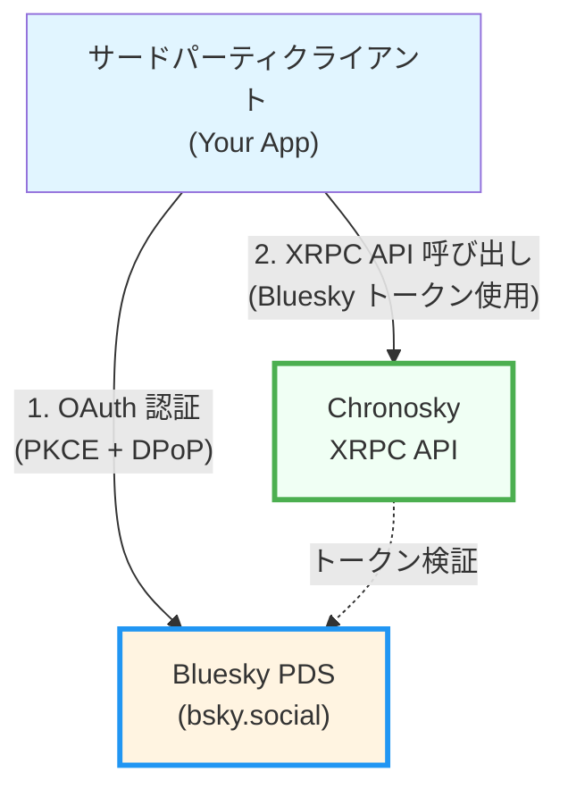
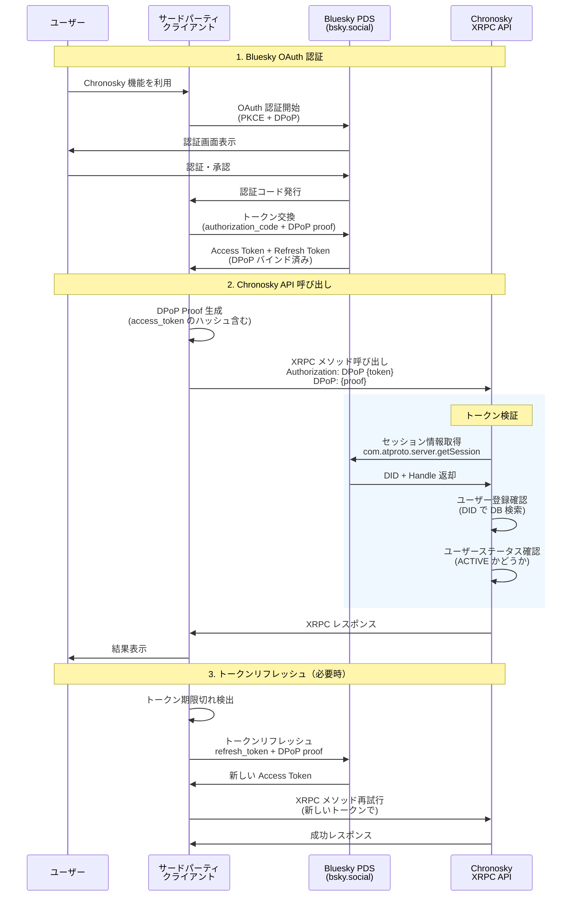
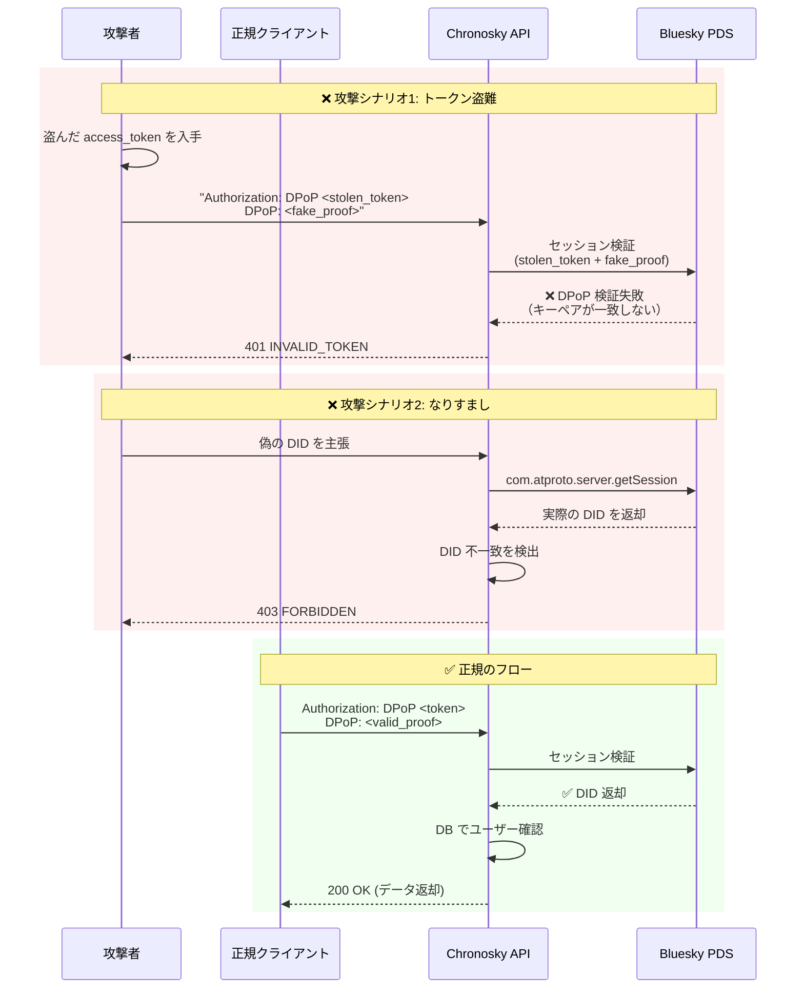

# Chronosky サードパーティクライアント実装ガイド

このドキュメントは、Chronosky の XRPC API を使用してサードパーティクライアントアプリケーションを実装する開発者向けのガイドです。

## 重要な注意事項

**クライアント登録は不要です。** Chronosky は AT Protocol の原則に従い、事前のクライアント登録なしでサードパーティアプリケーションが Chronosky API にアクセスできるよう設計されています。

- ✅ Bluesky OAuth 認証のみで API にアクセス可能
- ✅ クライアント ID やシークレットの管理不要
- ✅ 開発者登録や承認プロセス不要
- ⚠️ ユーザーは事前に Chronosky にサインアップしている必要があります

## 目次

1. [概要](#概要)
2. [アーキテクチャ](#アーキテクチャ)
3. [前提条件](#前提条件)
4. [認証フロー](#認証フロー)
5. [XRPC API の使用](#xrpc-api-の使用)
6. [利用可能なエンドポイント](#利用可能なエンドポイント)
7. [実装サンプル](#実装サンプル)
8. [エラーハンドリング](#エラーハンドリング)
9. [セキュリティベストプラクティス](#セキュリティベストプラクティス)

## 概要

Chronosky は AT Protocol エコシステムで動作する予約投稿サービスです。サードパーティクライアントは以下を実現できます：

- **Bluesky への直接投稿** - AT Protocol クライアントとして Bluesky PDS に直接アクセス
- **Chronosky スケジュールデータへのアクセス** - Chronosky XRPC API を使用して予約投稿の作成・管理

### アクセス要件

サードパーティクライアントが Chronosky API にアクセスするには：

1. ユーザーが Bluesky アカウントを持っていること
2. ユーザーが Chronosky にサインアップ済みであること
3. クライアントが Bluesky OAuth で認証を取得していること

**クライアント側での事前登録や承認は不要です。**

## アーキテクチャ

### AT Protocol 準拠のクライアント設計



**重要なポイント:**

1. **OAuth 認証は Bluesky で完結**
   - Chronosky は OAuth 認可サーバーではありません
   - すべての認証は Bluesky PDS で行われます

2. **トークンは共通**
   - Bluesky で取得したトークンを Chronosky API でも使用
   - トークン交換や追加認証は不要

3. **検証は Bluesky に委譲**
   - Chronosky はトークンの有効性を Bluesky に問い合わせて検証
   - ユーザー DID を取得して登録確認

### AT Protocol の概念

#### レコードタイプ（Collection）

AT Protocol では、データは **レコード** として分散リポジトリに保存されます。各レコードは **レコードタイプ（Collection）** に属します。

**例：Bluesky の投稿**
- レコードタイプ: `app.bsky.feed.post`
- 保存場所: ユーザーの PDS（Personal Data Server）
- アクセス: `at://` URI でグローバルにアクセス可能
- 例: `at://did:plc:xxx/app.bsky.feed.post/abc123`

#### XRPC メソッド（Procedure）

**XRPC メソッド** は、サーバー側で実行される操作（プロシージャ）です。

**例：AT Protocol 標準メソッド**
- `com.atproto.repo.createRecord` - レコード作成
- `com.atproto.repo.getRecord` - レコード取得
- `com.atproto.server.getSession` - セッション情報取得

#### Chronosky の設計判断

**Chronosky はレコードタイプを定義せず、XRPC メソッドのみを提供します。**

理由：

1. **予約投稿データは Chronosky 専用**
   - AT Protocol の分散リポジトリには適さない
   - スケジュール管理は中央サーバーで行う方が適切
   - 他の PDS にレプリケートする必要がない

2. **Bluesky 投稿は標準レコードタイプを使用**
   - 投稿実行時に `app.bsky.feed.post` レコードを作成
   - ユーザーの Bluesky PDS に保存される
   - AT Protocol エコシステムで標準的な方法

3. **シンプルな API 設計**
   - レコード操作ではなく、高レベルの操作を提供
   - クライアント開発者にとって使いやすい
   - 実装の詳細を隠蔽

**提供する XRPC メソッド：**

- `app.chronosky.schedule.createPost` - スケジュール作成（メソッド）
- `app.chronosky.schedule.listPosts` - スケジュール一覧（メソッド）
- `app.chronosky.schedule.updatePost` - スケジュール更新（メソッド）
- `app.chronosky.schedule.deletePost` - スケジュール削除（メソッド）

**提供しないもの：**

- ❌ `app.chronosky.schedule.post` - レコードタイプ（定義していない）
- ❌ `com.atproto.repo.createRecord` でのスケジュール作成

この設計により、Chronosky は AT Protocol エコシステムの一部として動作しながら、予約投稿という独自機能を提供します。

## 前提条件

### 必要な知識

- AT Protocol の基本概念
- OAuth 2.0 と PKCE (Proof Key for Code Exchange)
- DPoP (Demonstrating Proof of Possession)
- XRPC (Cross-organizational RPC protocol)

### 必要なライブラリ

```json
{
  "dependencies": {
    "@atproto/oauth-client": "^0.2.0",
    "@atproto/api": "^0.13.0",
    "jose": "^5.0.0"
  }
}
```

### OAuth Client Metadata の準備（重要）

**サードパーティクライアントは、自分自身のドメインで `client-metadata.json` を公開する必要があります。**

#### 1. client-metadata.json ファイルの作成

あなたのアプリケーションのドメインで、以下の内容の JSON ファイルを作成します。

**ファイルパス:** `https://your-app.example.com/client-metadata.json`

```json
{
  "client_id": "https://your-app.example.com/client-metadata.json",
  "client_name": "Your App Name",
  "client_uri": "https://your-app.example.com",
  "redirect_uris": [
    "https://your-app.example.com/oauth/callback"
  ],
  "scope": "atproto transition:generic",
  "grant_types": ["authorization_code", "refresh_token"],
  "response_types": ["code"],
  "token_endpoint_auth_method": "none",
  "application_type": "web",
  "dpop_bound_access_tokens": true,
  "require_pkce": true
}
```

#### 2. 必須フィールドの説明

| フィールド | 説明 | 例 |
|-----------|------|-----|
| `client_id` | このメタデータファイル自身の URL | `https://your-app.example.com/client-metadata.json` |
| `client_name` | アプリケーション名 | `"My Bluesky Client"` |
| `client_uri` | アプリケーションの URL | `https://your-app.example.com` |
| `redirect_uris` | OAuth コールバック URL（配列） | `["https://your-app.example.com/oauth/callback"]` |
| `scope` | 必要な OAuth スコープ | `"atproto transition:generic"` |
| `dpop_bound_access_tokens` | DPoP 必須（true に設定） | `true` |
| `require_pkce` | PKCE 必須（true に設定） | `true` |

#### 3. CORS ヘッダーの設定

このファイルには **CORS ヘッダー** を設定してください。Bluesky の OAuth サーバーがこのファイルを取得できるようにする必要があります。

**推奨 HTTP レスポンスヘッダー:**

```
Content-Type: application/json
Access-Control-Allow-Origin: *
Cache-Control: public, max-age=3600
```

#### 4. デプロイ方法の例

**静的ファイルとして配信（推奨）:**

```bash
# public/client-metadata.json として配置
# サーバー設定で適切な CORS ヘッダーを追加
```

**Node.js/Express での例:**

```javascript
app.get('/client-metadata.json', (req, res) => {
  res.header('Access-Control-Allow-Origin', '*');
  res.header('Content-Type', 'application/json');
  res.header('Cache-Control', 'public, max-age=3600');

  res.json({
    client_id: 'https://your-app.example.com/client-metadata.json',
    client_name: 'Your App Name',
    client_uri: 'https://your-app.example.com',
    redirect_uris: ['https://your-app.example.com/oauth/callback'],
    scope: 'atproto transition:generic',
    grant_types: ['authorization_code', 'refresh_token'],
    response_types: ['code'],
    token_endpoint_auth_method: 'none',
    application_type: 'web',
    dpop_bound_access_tokens: true,
    require_pkce: true,
  });
});
```

#### 5. 検証方法

以下のコマンドでメタデータが正しく公開されているか確認できます：

```bash
curl -H "Accept: application/json" https://your-app.example.com/client-metadata.json
```

**期待される結果:** JSON メタデータが返され、CORS ヘッダーが含まれている

#### ⚠️ 重要な注意事項

- **Chronosky のドメイン（`chronosky.app` や `api.chronosky.app`）を使用しないでください**
- サードパーティクライアントは、**自分自身のドメイン**で client-metadata.json を公開する必要があります
- このメタデータは Bluesky OAuth サーバーによって読み取られ、OAuth フローで使用されます
- Chronosky は OAuth 認可サーバーではないため、Chronosky 側での登録は不要です

## 認証フロー

### 重要：追加の連携手続きは不要

✅ **Bluesky で認証が完了していれば、Chronosky との追加の OAuth フローや連携手続きは不要です。**

サードパーティクライアントは以下の状態であれば、すぐに Chronosky API を使用できます：

- ✅ Bluesky OAuth で認証済み
- ✅ Access Token と DPoP Key を保持
- ✅ ユーザーが Chronosky にサインアップ済み

**「連携」ボタンは不要です。** 最初の API 呼び出し時に自動的に認証が確認されます。

### 連携確認の推奨パターン

ユーザー体験として「連携確認」を提供したい場合：

```typescript
// 「Chronosky と連携」ボタンのハンドラー
async function verifyChronoskyConnection() {
  try {
    // 既存の Bluesky トークンで API を呼び出すだけ
    await chronoskyClient.listSchedules({ limit: 1 });

    // 成功 = 自動的に連携済み
    showSuccess('Successfully connected to Chronosky!');
    enableChronoskyFeatures();
  } catch (error) {
    if (error.code === 'USER_NOT_REGISTERED') {
      // ユーザーが Chronosky にサインアップしていない
      showError('Please sign up at Chronosky first');
      openExternalLink('https://chronosky.app');
    } else {
      showError('Connection failed: ' + error.message);
    }
  }
}
```

### フロー概要図



### 1. Bluesky OAuth 認証

Chronosky API を使用する前に、Bluesky で OAuth 認証を完了する必要があります。

⚠️ **重要:** `clientId` には、前のセクションで作成した **あなた自身のアプリケーションの client-metadata.json の URL** を指定してください。Chronosky のドメインは使用しません。

```typescript
import { OAuthClient } from '@atproto/oauth-client';

// OAuth クライアントの初期化
// ⚠️ clientId はあなたのアプリケーションのドメインを使用
const oauthClient = new OAuthClient({
  clientId: 'https://your-app.example.com/client-metadata.json',  // あなたのドメイン
  redirectUri: 'https://your-app.example.com/oauth/callback',     // あなたのコールバック URL
  scopes: ['atproto', 'transition:generic'],
  // DPoP を有効化（必須）
  enableDPoP: true,
});

// 認証フローの開始
const authUrl = await oauthClient.authorize(userHandle, {
  // PKCE を使用（必須）
  codeChallengeMethod: 'S256',
});

// ユーザーを Bluesky 認証ページにリダイレクト
window.location.href = authUrl;
```

**認証フローの流れ:**

1. **ユーザーは Bluesky の認証ページにリダイレクトされます**（Chronosky ではありません）
2. ユーザーが Bluesky アカウントでログイン・承認
3. Bluesky が `your-app.example.com/oauth/callback` にリダイレクト
4. あなたのアプリケーションがコールバックを処理してトークンを取得

### 2. コールバック処理

```typescript
// OAuth コールバックを受け取る
const params = new URLSearchParams(window.location.search);
const code = params.get('code');
const state = params.get('state');

// トークン交換
const tokens = await oauthClient.callback(code, state);

// 取得される情報
const {
  accessToken,    // Bluesky access token
  refreshToken,   // Bluesky refresh token
  dpopKey,        // DPoP key pair
  did,            // ユーザーの DID
  handle,         // ユーザーの handle
} = tokens;
```

### 3. DID と Handle の取得

```typescript
import { AtpAgent } from '@atproto/api';

const agent = new AtpAgent({
  service: 'https://bsky.social',
});

// セッション情報の取得
const session = await agent.com.atproto.server.getSession(
  {},
  {
    headers: {
      Authorization: `DPoP ${accessToken}`,
      DPoP: await generateDPoPProof(dpopKey, 'GET', agent.service),
    },
  }
);

console.log(session.data.did);    // did:plc:xxx
console.log(session.data.handle); // user.bsky.social
```

## XRPC API の使用

### 認証情報の付加

Chronosky XRPC API へのすべてのリクエストには、**Bluesky で取得した access token と DPoP proof** が必要です。

**重要：** Bluesky OAuth で既に取得済みのトークンをそのまま使用します。Chronosky 専用のトークンは不要です。

#### 必要な HTTP ヘッダー

```http
Authorization: DPoP <access_token>
DPoP: <dpop_proof>
Content-Type: application/json
```

| ヘッダー | 説明 | 例 |
|---------|------|-----|
| `Authorization` | DPoP スキームで Bluesky access token を指定 | `DPoP eyJ0eXAiOiJhdCtqd3QiLCJhbGc...` |
| `DPoP` | このリクエスト用に生成した DPoP Proof（JWT） | `eyJhbGciOiJFUzI1NiIsInR5cCI6ImRwb3Arand0Iiwian...` |

#### セキュリティ上の注意

- ✅ 必ず **HTTPS** を使用
- ✅ Access Token は DPoP キーペアにバインド済み
- ✅ DPoP Proof は **リクエストごとに新規生成**（jti は一意）
- ❌ トークンを盗まれても、対応する秘密鍵がないと使用不可

### 基本的なリクエスト構造

```typescript
import { generateKeyPair, SignJWT } from 'jose';

// DPoP Proof の生成
async function generateDPoPProof(
  dpopKey: CryptoKeyPair,
  method: string,
  url: string
): Promise<string> {
  const jwk = await exportJWK(dpopKey.publicKey);

  const proof = await new SignJWT({
    htm: method,
    htu: url,
    iat: Math.floor(Date.now() / 1000),
    jti: crypto.randomUUID(),
  })
    .setProtectedHeader({
      alg: 'ES256',
      typ: 'dpop+jwt',
      jwk,
    })
    .sign(dpopKey.privateKey);

  return proof;
}

// Chronosky API リクエスト
async function callChronoskyAPI(
  method: string,
  endpoint: string,
  accessToken: string,
  dpopKey: CryptoKeyPair,
  body?: any
): Promise<Response> {
  const url = `https://api.chronosky.app/xrpc/${endpoint}`;
  const dpopProof = await generateDPoPProof(dpopKey, method, url);

  return fetch(url, {
    method,
    headers: {
      'Authorization': `DPoP ${accessToken}`,
      'DPoP': dpopProof,
      'Content-Type': 'application/json',
    },
    body: body ? JSON.stringify(body) : undefined,
  });
}
```

## 利用可能なエンドポイント

### スケジュール管理 API

#### `app.chronosky.schedule.createPost`

予約投稿を作成します。

**エンドポイント:** `POST /xrpc/app.chronosky.schedule.createPost`

**リクエストボディ:**

```typescript
interface CreateScheduleRequest {
  // 以下のいずれかが必須（両方指定された場合は posts が優先）
  text?: string;                           // シンプルな単一投稿用
  posts?: Array<{                          // スレッド投稿用（高度な使用方法）
    content: string;                       // 投稿本文
    facets?: Array<{                       // リンクやメンションの装飾（オプション）
      index: { byteStart: number; byteEnd: number };
      features: Array<{
        $type: string;
        uri?: string;      // リンクの場合
        did?: string;      // メンションの場合
      }>;
    }>;
  }>;

  // 予約日時（必須）
  scheduledAt: string;                     // ISO 8601 形式（例: "2026-01-15T10:00:00Z"）

  // オプション設定
  parentPostRecordKey?: string;            // リプライ先の rkey（オプション）
  threadgateRules?: Array<'mention' | 'follower' | 'following'>; // スレッド制限（オプション）
  disableQuotePosts?: boolean;             // 引用投稿を無効化（オプション、デフォルト: false）
}
```

**レスポンス:**

```typescript
interface CreateScheduleResponse {
  success: boolean;                        // 作成成功フラグ
  postIds: string[];                       // 作成された投稿 ID のリスト
  scheduledAt: string;                     // 予約日時（ISO 8601形式）
}
```

**バリデーションルール:**

1. **最小予約時間:** 現在時刻から最低5分以上先に設定する必要があります
2. **プラン制限:**
   - **文字数制限:** プランに応じた最大文字数（デフォルト: 300文字）
   - **予約可能日数:** プランに応じた最大予約日数（デフォルト: 7日）
   - **予約間隔:** 前回の予約投稿からの最小間隔（デフォルト: 1分）
   - **同時予約数:** 同時に予約できる投稿の上限（デフォルト: 50件）
   - **スレッド投稿:** プランによっては複数投稿が許可されない場合があります
   - **スレッド投稿数:** プランに応じたスレッド内投稿数の上限（デフォルト: 25件）

**使用例（シンプル）:**

```typescript
const response = await callChronoskyAPI(
  'POST',
  'app.chronosky.schedule.createPost',
  accessToken,
  dpopKey,
  {
    text: 'Hello from third-party client!',
    scheduledAt: '2026-01-15T10:00:00Z',
  }
);

const result = await response.json();
if (result.success) {
  console.log(`Created ${result.postIds.length} scheduled post(s)`);
}
```

**使用例（スレッド投稿）:**

```typescript
const response = await callChronoskyAPI(
  'POST',
  'app.chronosky.schedule.createPost',
  accessToken,
  dpopKey,
  {
    posts: [
      { content: 'First post in thread' },
      { content: 'Second post in thread' },
      { content: 'Third post in thread' },
    ],
    scheduledAt: '2026-01-15T10:00:00Z',
    threadgateRules: ['follower'],  // フォロワーのみ返信可能
  }
);
```

#### `app.chronosky.schedule.listPosts`

ユーザーの予約投稿一覧を取得します。

**エンドポイント:** `GET /xrpc/app.chronosky.schedule.listPosts`

**クエリパラメータ:**

```typescript
interface ListPostsQuery {
  status?: 'pending' | 'executing' | 'completed' | 'failed' | 'cancelled'; // 投稿ステータスでフィルタ（大文字小文字を問わない）
  page?: number;                   // ページ番号（デフォルト: 1）
  limit?: number;                  // ページあたりの取得件数（デフォルト: 20）
}
```

**レスポンス:**

```typescript
interface ListPostsResponse {
  posts: Array<{
    id: string;                    // 投稿 ID
    content: string;               // 投稿本文
    scheduledAt: string;           // 予約日時（ISO 8601形式）
    status: 'PENDING' | 'EXECUTING' | 'COMPLETED' | 'FAILED' | 'CANCELLED'; // 投稿ステータス
    createdAt: string;             // 作成日時（ISO 8601形式）
    updatedAt: string;             // 更新日時（ISO 8601形式）
    parentPostId?: string;         // 親投稿 ID（スレッドの場合）
    threadOrder?: number;          // スレッド内の順序
  }>;
  pagination: {
    page: number;                  // 現在のページ番号
    limit: number;                 // ページあたりの件数
    total: number;                 // 総件数
    totalPages: number;            // 総ページ数
  };
}
```

**投稿ステータス:**

- `PENDING` - 予約済み（実行待ち）
- `EXECUTING` - 実行中
- `COMPLETED` - 投稿完了
- `FAILED` - 投稿失敗
- `CANCELLED` - キャンセル済み

**使用例:**

```typescript
// PENDING 状態の投稿を取得
const response = await callChronoskyAPI(
  'GET',
  'app.chronosky.schedule.listPosts?status=pending&page=1&limit=20',
  accessToken,
  dpopKey
);

const data = await response.json();
console.log(`Total: ${data.pagination.total} posts`);
data.posts.forEach(post => {
  console.log(`${post.scheduledAt}: ${post.content}`);
});
```

**大文字小文字の扱い:**

status パラメータは大文字小文字を問いません。`pending`、`PENDING`、`Pending` のいずれも受け付けます。

```typescript
// これらはすべて同じ結果を返します
'?status=pending'
'?status=PENDING'
'?status=Pending'
```

#### `app.chronosky.schedule.getPost`

特定の予約投稿の詳細を取得します。

**エンドポイント:** `GET /xrpc/app.chronosky.schedule.getPost`

**クエリパラメータ:**

```typescript
interface GetPostQuery {
  id: string;                      // 取得する投稿 ID
}
```

**レスポンス:**

```typescript
interface GetPostResponse {
  post: {
    id: string;                    // 投稿 ID
    content: string;               // 投稿本文
    scheduledAt: string;           // 予約日時（ISO 8601形式）
    status: 'PENDING' | 'EXECUTING' | 'COMPLETED' | 'FAILED' | 'CANCELLED';
    createdAt: string;             // 作成日時
    updatedAt: string;             // 更新日時
    parentPostId?: string;         // 親投稿 ID（スレッドの場合）
    threadOrder?: number;          // スレッド内の順序
    languages?: string[];          // 言語設定
    facets?: Array<{...}>;         // リンクやメンションの装飾
    embed?: {...};                 // 埋め込みコンテンツ
    threadgateRules?: string[];    // スレッド制限ルール
    disableQuotePosts?: boolean;   // 引用投稿無効化
  };
}
```

**使用例:**

```typescript
const response = await callChronoskyAPI(
  'GET',
  `app.chronosky.schedule.getPost?id=${postId}`,
  accessToken,
  dpopKey
);

const { post } = await response.json();
console.log(`Post: ${post.content}`);
console.log(`Scheduled for: ${post.scheduledAt}`);
```

#### `app.chronosky.schedule.updatePost`

予約投稿を更新します。**PENDING 状態の投稿のみ更新可能です。**

**エンドポイント:** `POST /xrpc/app.chronosky.schedule.updatePost`

**リクエストボディ:**

```typescript
interface UpdatePostRequest {
  id: string;                      // 更新する投稿 ID（必須）
  content?: string;                // 新しい投稿本文
  scheduledAt?: string;            // 新しい予約日時（ISO 8601形式）
  languages?: string[];            // 言語設定（例: ["ja", "en"]）
  facets?: Array<{                 // リンクやメンションの装飾
    index: { byteStart: number; byteEnd: number };
    features: Array<{
      $type: string;
      uri?: string;
      did?: string;
    }>;
  }>;
  embed?: {                        // 埋め込みコンテンツ
    $type: string;
    // ... 埋め込みタイプに応じたフィールド
  };
}
```

**レスポンス:**

```typescript
interface UpdatePostResponse {
  post: {
    id: string;
    content: string;
    scheduledAt: string;
    status: string;
    updatedAt: string;
  };
}
```

**制約事項:**

- ✅ **PENDING** 状態の投稿のみ更新可能
- ❌ **EXECUTING**、**COMPLETED**、**FAILED**、**CANCELLED** 状態の投稿は更新不可
- ✅ 少なくとも1つのフィールドを指定する必要があります

**使用例:**

```typescript
// 投稿本文と予約日時を更新
const response = await callChronoskyAPI(
  'POST',
  'app.chronosky.schedule.updatePost',
  accessToken,
  dpopKey,
  {
    id: 'post-id-here',
    content: 'Updated post content',
    scheduledAt: '2026-01-16T10:00:00Z',
  }
);

const { post } = await response.json();
console.log(`Updated: ${post.id}`);
```

**エラーレスポンス例:**

```json
{
  "error": "INVALID_REQUEST",
  "message": "Post not found or cannot be updated"
}
```

このエラーは以下の場合に発生します：
- 投稿が存在しない
- 投稿が他のユーザーに属している
- 投稿が PENDING 状態ではない（既に実行済み、完了済み、失敗、キャンセル済み）

#### `app.chronosky.schedule.deletePost`

予約投稿を削除します。**PENDING 状態の投稿のみ削除可能です。**

**エンドポイント:** `POST /xrpc/app.chronosky.schedule.deletePost`

**リクエストボディ:**

```typescript
interface DeletePostRequest {
  id: string;                      // 削除する投稿 ID（必須）
}
```

**レスポンス:**

```typescript
interface DeletePostResponse {
  success: boolean;                // 削除成功フラグ
}
```

**制約事項:**

- ✅ **PENDING** 状態の投稿のみ削除可能
- ❌ **EXECUTING**、**COMPLETED**、**FAILED**、**CANCELLED** 状態の投稿は削除不可
- ✅ 自分が作成した投稿のみ削除可能（他のユーザーの投稿は削除不可）

**使用例:**

```typescript
const response = await callChronoskyAPI(
  'POST',
  'app.chronosky.schedule.deletePost',
  accessToken,
  dpopKey,
  {
    id: 'post-id-here',
  }
);

const result = await response.json();
if (result.success) {
  console.log('Post deleted successfully');
}
```

**エラーレスポンス例:**

```json
{
  "error": "INVALID_REQUEST",
  "message": "Post not found or cannot be deleted"
}
```

このエラーは以下の場合に発生します：
- 投稿が存在しない
- 投稿が他のユーザーに属している
- 投稿が PENDING 状態ではない（既に実行済み、完了済み、失敗、キャンセル済み）

**スレッド投稿の削除:**

スレッド投稿（複数投稿）の場合、各投稿は個別に削除する必要があります。親投稿を削除しても、子投稿は自動的には削除されません。

```typescript
// スレッド内の各投稿を個別に削除
const threadPostIds = ['post-1', 'post-2', 'post-3'];
for (const postId of threadPostIds) {
  await callChronoskyAPI(
    'POST',
    'app.chronosky.schedule.deletePost',
    accessToken,
    dpopKey,
    { id: postId }
  );
}
```

## 実装サンプル

### 完全な TypeScript 実装例

⚠️ **重要:** 以下のコード内の `your-app.example.com` は、**あなたのアプリケーションの実際のドメイン**に置き換えてください。Chronosky のドメインは使用しません。

```typescript
import { OAuthClient } from '@atproto/oauth-client';
import { generateKeyPair, exportJWK, SignJWT } from 'jose';

class ChronoskyClient {
  private oauthClient: OAuthClient;
  private accessToken?: string;
  private dpopKey?: CryptoKeyPair;
  private did?: string;

  constructor() {
    // ⚠️ clientId と redirectUri はあなたのアプリケーションのドメインを使用
    this.oauthClient = new OAuthClient({
      clientId: 'https://your-app.example.com/client-metadata.json',  // あなたのドメイン
      redirectUri: 'https://your-app.example.com/oauth/callback',     // あなたのコールバック
      scopes: ['atproto', 'transition:generic'],
      enableDPoP: true,
    });
  }

  // 認証フロー開始
  async startAuth(handle: string): Promise<string> {
    return await this.oauthClient.authorize(handle, {
      codeChallengeMethod: 'S256',
    });
  }

  // コールバック処理
  async handleCallback(code: string, state: string): Promise<void> {
    const tokens = await this.oauthClient.callback(code, state);
    this.accessToken = tokens.accessToken;
    this.dpopKey = tokens.dpopKey;
    this.did = tokens.did;
  }

  // DPoP Proof 生成
  private async generateDPoPProof(method: string, url: string): Promise<string> {
    if (!this.dpopKey) throw new Error('Not authenticated');

    const jwk = await exportJWK(this.dpopKey.publicKey);

    return await new SignJWT({
      htm: method,
      htu: url,
      iat: Math.floor(Date.now() / 1000),
      jti: crypto.randomUUID(),
    })
      .setProtectedHeader({
        alg: 'ES256',
        typ: 'dpop+jwt',
        jwk,
      })
      .sign(this.dpopKey.privateKey);
  }

  // API リクエスト
  private async request(
    method: string,
    endpoint: string,
    body?: any
  ): Promise<any> {
    if (!this.accessToken || !this.dpopKey) {
      throw new Error('Not authenticated');
    }

    const url = `https://api.chronosky.app/xrpc/${endpoint}`;
    const dpopProof = await this.generateDPoPProof(method, url);

    const response = await fetch(url, {
      method,
      headers: {
        'Authorization': `DPoP ${this.accessToken}`,
        'DPoP': dpopProof,
        'Content-Type': 'application/json',
      },
      body: body ? JSON.stringify(body) : undefined,
    });

    if (!response.ok) {
      const error = await response.json();
      throw new Error(`API Error: ${error.message}`);
    }

    return await response.json();
  }

  // スケジュール作成
  async createSchedule(
    text: string,
    scheduledAt: string,
    options?: {
      replyTo?: { uri: string; cid: string };
      langs?: string[];
    }
  ) {
    return await this.request('POST', 'app.chronosky.schedule.createPost', {
      text,
      scheduledAt,
      ...options,
    });
  }

  // スケジュール一覧取得
  async listSchedules(options?: {
    limit?: number;
    cursor?: string;
    status?: string;
  }) {
    const params = new URLSearchParams();
    if (options?.limit) params.append('limit', options.limit.toString());
    if (options?.cursor) params.append('cursor', options.cursor);
    if (options?.status) params.append('status', options.status);

    const endpoint = `app.chronosky.schedule.listPosts?${params.toString()}`;
    return await this.request('GET', endpoint);
  }

  // スケジュール更新
  async updateSchedule(
    uri: string,
    updates: {
      text?: string;
      scheduledAt?: string;
    }
  ) {
    return await this.request('POST', 'app.chronosky.schedule.updatePost', {
      uri,
      ...updates,
    });
  }

  // スケジュール削除
  async deleteSchedule(uri: string) {
    return await this.request('POST', 'app.chronosky.schedule.deletePost', {
      uri,
    });
  }
}

// 使用例
const client = new ChronoskyClient();

// 1. 認証
const authUrl = await client.startAuth('user.bsky.social');
// ユーザーをリダイレクト...

// 2. コールバック処理
await client.handleCallback(code, state);

// 3. API 使用
const schedule = await client.createSchedule(
  'Hello from my app!',
  '2026-01-15T10:00:00Z',
  { langs: ['ja', 'en'] }
);

console.log(`Created: ${schedule.uri}`);
```

## エラーハンドリング

### CORS エラーのトラブルシューティング

サードパーティクライアントから XRPC API を呼び出す際、CORS エラーが発生しないように設計されています。

**XRPC エンドポイント (`/xrpc/*`) の CORS 設定:**

- ✅ `Access-Control-Allow-Origin: *` - すべてのオリジンを許可
- ✅ `Access-Control-Allow-Headers` - `Authorization`, `DPoP` ヘッダーを許可
- ✅ `Access-Control-Expose-Headers` - `DPoP-Nonce` ヘッダーを公開
- ✅ `Access-Control-Allow-Credentials: false` - Cookie 不要

**CORS エラーが発生する場合の確認事項:**

1. **エンドポイント URL の確認**
   - ✅ 正しい: `https://api.chronosky.app/xrpc/app.chronosky.schedule.listPosts`
   - ❌ 間違い: `https://api.chronosky.app/api/posts` (XRPC 以外のエンドポイント)
   
2. **必須ヘッダーの確認**
   ```javascript
   headers: {
     'Content-Type': 'application/json',
     'Authorization': `DPoP ${accessToken}`,  // 必須
     'DPoP': dpopProof                        // 必須
   }
   ```

3. **HTTPS の使用**
   - 本番環境では必ず HTTPS を使用
   - ローカル開発時は HTTP でも可

**注意:** `/api/*` エンドポイントは Chronosky フロントエンド専用のため、サードパーティクライアントは使用できません。必ず `/xrpc/*` エンドポイントを使用してください。

### エラーレスポンス形式

```typescript
interface ErrorResponse {
  error: string;           // エラーコード
  message: string;         // エラーメッセージ
}
```

### 一般的なエラーコード

#### 認証・認可エラー (HTTP 401 / 403)

| エラーコード | HTTP Status | 説明 | 対処方法 |
|------------|-------------|------|---------|
| `AUTHENTICATION_REQUIRED` | 401 | 認証が必要です | Authorization ヘッダーを確認 |
| `INVALID_TOKEN` | 401 | トークンが無効または期限切れです | トークンをリフレッシュ |
| `DPOP_PROOF_REQUIRED` | 401 | DPoP proof ヘッダーがありません | DPoP ヘッダーを追加 |
| `INVALID_DPOP_PROOF` | 401 | DPoP proof の検証に失敗しました | DPoP Proof の生成ロジックを確認 |
| `USER_NOT_REGISTERED` | 403 | Chronosky にユーザーが登録されていません | ユーザーに Chronosky サインアップを促す |
| `USER_NOT_ACTIVE` | 403 | ユーザーアカウントがアクティブではありません | ユーザーステータスを確認 |
| `SERVICE_ACCOUNT_BLOCKED` | 403 | サービスアカウントがブロックされています | ブロック状態を解除 |
| `TOKEN_VERIFICATION_FAILED` | 500 | Bluesky でのトークン検証に失敗しました | 後でリトライ |

#### バリデーションエラー (HTTP 400)

| エラーコード | HTTP Status | 説明 | 対処方法 |
|------------|-------------|------|---------|
| `INVALID_REQUEST` | 400 | リクエストパラメータが不正です | パラメータを確認 |
| `INVALID_SCHEDULE_TIME` | 400 | 予約日時が過去です | 未来の日時を指定 |
| `SCHEDULE_TOO_SOON` | 400 | 予約日時が近すぎます（最低5分必要） | 5分以上先の日時を指定 |

#### プラン制限エラー (HTTP 403 / 429)

| エラーコード | HTTP Status | 説明 | 対処方法 |
|------------|-------------|------|---------|
| `POST_LENGTH_EXCEEDED` | 403 | 投稿が文字数制限を超過しています | 文字数を減らすか、プランをアップグレード |
| `SCHEDULE_DAYS_EXCEEDED` | 403 | 予約可能日数を超過しています | 予約日時を早めるか、プランをアップグレード |
| `SCHEDULE_INTERVAL_VIOLATED` | 403 | 予約間隔が短すぎます | 最小間隔を空けるか、プランをアップグレード |
| `PENDING_POSTS_LIMIT_EXCEEDED` | 429 | 同時予約数の上限に達しています | 既存の予約を削除するか、プランをアップグレード |
| `THREAD_NOT_SUPPORTED` | 403 | プランがスレッド投稿に対応していません | 単一投稿にするか、プランをアップグレード |
| `THREAD_LIMIT_EXCEEDED` | 403 | スレッド投稿数が上限を超過しています | 投稿数を減らすか、プランをアップグレード |

**プラン制限エラーのレスポンス形式:**

```typescript
interface PlanLimitErrorResponse {
  error: string;                   // エラーコード
  message: string;                 // エラーメッセージ
  limit: number;                   // プランの制限値
  current: number;                 // 現在の値
  upgradeRequired: boolean;        // アップグレード推奨フラグ（常に true）
}
```

**例:**

```json
{
  "error": "POST_LENGTH_EXCEEDED",
  "message": "Plan allows maximum 300 characters per post. Post #1 has 350 characters.",
  "limit": 300,
  "current": 350,
  "upgradeRequired": true
}
```

#### その他のエラー (HTTP 404 / 429 / 500)

| エラーコード | HTTP Status | 説明 | 対処方法 |
|------------|-------------|------|---------|
| `SCHEDULE_NOT_FOUND` | 404 | 指定されたスケジュールが見つかりません | ID を確認 |
| `RATE_LIMIT_EXCEEDED` | 429 | API レート制限を超過しました | 待機してリトライ |
| `INTERNAL_SERVER_ERROR` | 500 | サーバー内部エラー | 後でリトライ |

### USER_NOT_REGISTERED エラーの詳細

このエラーは、ユーザーが Bluesky で認証済みだが、Chronosky にサインアップしていない場合に発生します。

**エラーレスポンス例:**

```json
{
  "error": "USER_NOT_REGISTERED",
  "message": "User is not registered in Chronosky. Please sign up first."
}
```

**HTTP Status:** `403 Forbidden`

**推奨される対処:**

```typescript
async function handleChronoskyAPI() {
  try {
    const result = await chronoskyClient.listSchedules();
    return result;
  } catch (error) {
    if (error.error === 'USER_NOT_REGISTERED') {
      // ユーザーに Chronosky サインアップを促す
      showNotification({
        title: 'Chronosky Registration Required',
        message: 'To use scheduling features, please sign up at Chronosky.',
        actions: [
          {
            label: 'Sign Up Now',
            url: 'https://chronosky.app',
            primary: true,
          },
          {
            label: 'Later',
            dismiss: true,
          },
        ],
      });
    } else {
      // その他のエラー処理
      throw error;
    }
  }
}
```

**重要な注意事項:**

- ユーザーが Chronosky にサインアップしていない場合、API は常に `403 USER_NOT_REGISTERED` を返します
- サードパーティクライアント側でユーザーを Chronosky に登録することはできません
- ユーザー自身が https://chronosky.app でサインアップする必要があります

### エラーハンドリング実装例

```typescript
async function handleAPICall() {
  try {
    const result = await client.createSchedule('Hello', '2026-01-15T10:00:00Z');
    return result;
  } catch (error) {
    const errorData = await error.response?.json();

    // トークンエラー: リフレッシュしてリトライ
    if (error.status === 401 && errorData?.error === 'INVALID_TOKEN') {
      await client.refreshToken();
      return await client.createSchedule('Hello', '2026-01-15T10:00:00Z');
    }

    // レート制限: 待機してリトライ
    if (error.status === 429) {
      await new Promise(resolve => setTimeout(resolve, 60000));
      return await client.createSchedule('Hello', '2026-01-15T10:00:00Z');
    }

    // プラン制限エラー: ユーザーに通知
    if (errorData?.upgradeRequired) {
      showUpgradePrompt({
        error: errorData.error,
        message: errorData.message,
        currentValue: errorData.current,
        limit: errorData.limit,
      });
      return null;
    }

    // バリデーションエラー: ユーザーに修正を促す
    if (error.status === 400) {
      showValidationError(errorData.message);
      return null;
    }

    // その他のエラー
    console.error('API Error:', error);
    throw error;
  }
}

// プラン制限エラーのハンドリング例
function showUpgradePrompt(errorInfo: {
  error: string;
  message: string;
  currentValue: number;
  limit: number;
}) {
  const errorMessages = {
    POST_LENGTH_EXCEEDED: `投稿が長すぎます（${errorInfo.currentValue}文字）。現在のプランでは${errorInfo.limit}文字までです。`,
    SCHEDULE_DAYS_EXCEEDED: `予約日が遠すぎます（${errorInfo.currentValue}日後）。現在のプランでは${errorInfo.limit}日先までです。`,
    SCHEDULE_INTERVAL_VIOLATED: `予約間隔が短すぎます（${errorInfo.currentValue}分）。現在のプランでは${errorInfo.limit}分以上空ける必要があります。`,
    PENDING_POSTS_LIMIT_EXCEEDED: `同時予約数の上限に達しました（${errorInfo.limit}件）。既存の予約を削除するか、プランをアップグレードしてください。`,
    THREAD_NOT_SUPPORTED: 'スレッド投稿は現在のプランではご利用いただけません。',
    THREAD_LIMIT_EXCEEDED: `スレッド投稿数が多すぎます（${errorInfo.currentValue}件）。現在のプランでは${errorInfo.limit}件までです。`,
  };

  const message = errorMessages[errorInfo.error] || errorInfo.message;

  showNotification({
    title: 'プラン制限に達しました',
    message,
    actions: [
      {
        label: 'プランをアップグレード',
        url: 'https://chronosky.app/settings/plans',
        primary: true,
      },
      {
        label: 'キャンセル',
        dismiss: true,
      },
    ],
  });
}
```

### トラブルシューティング

#### 問題: "invalid input value for enum PostStatus: 'pending'"

**原因:** `status` パラメータが小文字で送信され、データベースの enum 型（大文字）と一致しない

**解決方法:** API は自動的に大文字に変換するため、この問題は発生しません。ただし、古いバージョンの API を使用している場合は、status パラメータを大文字で送信してください。

```typescript
// どちらも正常に動作します
'?status=pending'  // ✅ 自動的に PENDING に変換
'?status=PENDING'  // ✅ そのまま使用
```

#### 問題: プラン制限エラーが頻繁に発生する

**原因:** 無料プランまたは低いプランを使用している

**解決方法:**

1. **文字数制限 (POST_LENGTH_EXCEEDED)**
   - 投稿を短くする
   - リンクを短縮する
   - プランをアップグレードして制限を緩和

2. **予約間隔制限 (SCHEDULE_INTERVAL_VIOLATED)**
   - 予約投稿の間隔を広げる
   - 一度に複数投稿せず、時間を分散させる
   - プランをアップグレードして最小間隔を短縮

3. **同時予約数制限 (PENDING_POSTS_LIMIT_EXCEEDED)**
   - 既存の予約投稿を削除または完了させる
   - プランをアップグレードして上限を増やす

4. **スレッド投稿制限 (THREAD_NOT_SUPPORTED / THREAD_LIMIT_EXCEEDED)**
   - 単一投稿に変更する
   - スレッドの投稿数を減らす
   - プランをアップグレードしてスレッド投稿を有効化

#### 問題: "User not found" エラーが発生する

**原因:** トークンから取得した DID がデータベースに登録されていない

**解決方法:**

1. ユーザーが Chronosky にサインアップしているか確認
2. サインアップしていない場合、https://chronosky.app にアクセスしてサインアップを完了
3. サインアップ後、再度 API を呼び出す

#### 問題: DPoP Proof 検証エラー

**原因:** DPoP Proof の生成が正しくない、または古いトークンを使用している

**解決方法:**

1. **jti（JWT ID）が一意であることを確認**
   ```typescript
   jti: crypto.randomUUID()  // ✅ 毎回新しい UUID を生成
   ```

2. **htm と htu が正確であることを確認**
   ```typescript
   htm: 'POST',  // HTTP メソッドは大文字
   htu: 'https://api.chronosky.app/xrpc/app.chronosky.schedule.createPost',  // 完全な URL
   ```

3. **iat（発行時刻）が現在時刻であることを確認**
   ```typescript
   iat: Math.floor(Date.now() / 1000)  // Unix タイムスタンプ（秒）
   ```

4. **DPoP キーペアが正しいことを確認**
   - Access Token 取得時に使用したキーペアと同じものを使用
   - キーペアを再生成した場合は、トークンも再取得

## セキュリティベストプラクティス

### なりすまし対策の仕組み

Chronosky は **多層防御** により、なりすましやトークン盗難を防止しています。

#### 防御メカニズム



#### セキュリティ層

1. **DPoP トークンバインディング（レイヤー1）**
   - Access Token は DPoP キーペアにバインド済み
   - トークンを盗んでも、対応する秘密鍵がないと使用不可
   - 各リクエストで新しい DPoP Proof の生成が必須

2. **Bluesky PDS による検証（レイヤー2）**
   - Chronosky は Bluesky PDS に `com.atproto.server.getSession` を呼び出し
   - Bluesky PDS がトークンと DPoP Proof の両方を検証
   - 検証成功時に **信頼できる DID** を返却

3. **DID ベース認証（レイヤー3）**
   - クライアントが主張する DID ではなく、**Bluesky PDS が返した DID** を使用
   - なりすましは不可能
   - ユーザー登録確認もこの DID で実施

#### なぜ安全なのか

| 攻撃手法 | 防御方法 | 結果 |
|---------|---------|------|
| トークン盗難 | DPoP バインディング | ❌ 秘密鍵がないと使えない |
| DPoP Proof 偽造 | Bluesky PDS が検証 | ❌ 公開鍵が一致しない |
| DID なりすまし | Bluesky PDS が実際の DID を返却 | ❌ 検証失敗 |
| リプレイ攻撃 | jti（一意の ID）必須 | ❌ 同じ Proof は再利用不可 |

**結論:** トークンと秘密鍵の両方を盗まない限り、なりすましは事実上不可能です。

### 1. DPoP Key の安全な管理

```typescript
// ❌ 悪い例: ローカルストレージに保存
localStorage.setItem('dpopKey', JSON.stringify(dpopKey));

// ✅ 良い例: IndexedDB や暗号化されたストレージを使用
import { openDB } from 'idb';

const db = await openDB('chronosky-client', 1, {
  upgrade(db) {
    db.createObjectStore('keys');
  },
});

await db.put('keys', dpopKey, 'dpop');
```

### 2. Access Token の有効期限管理

```typescript
class TokenManager {
  private accessToken: string;
  private expiresAt: number;

  async getToken(): Promise<string> {
    if (Date.now() >= this.expiresAt) {
      await this.refreshToken();
    }
    return this.accessToken;
  }

  async refreshToken(): Promise<void> {
    // リフレッシュトークンを使用して新しいトークンを取得
    const tokens = await this.oauthClient.refresh(this.refreshToken);
    this.accessToken = tokens.accessToken;
    this.expiresAt = Date.now() + tokens.expiresIn * 1000;
  }
}
```

### 3. HTTPS の使用

```typescript
// 必ず HTTPS を使用
const API_BASE_URL = 'https://api.chronosky.app'; // ✅
// const API_BASE_URL = 'http://api.chronosky.app'; // ❌
```

### 4. レート制限の遵守

```typescript
class RateLimiter {
  private lastRequestTime = 0;
  private minInterval = 1000; // 1秒に1リクエスト

  async throttle(): Promise<void> {
    const now = Date.now();
    const timeSinceLastRequest = now - this.lastRequestTime;

    if (timeSinceLastRequest < this.minInterval) {
      await new Promise(resolve =>
        setTimeout(resolve, this.minInterval - timeSinceLastRequest)
      );
    }

    this.lastRequestTime = Date.now();
  }
}
```

### 5. ユーザー DID の検証

```typescript
async function verifyUserDID(expectedDID: string): Promise<boolean> {
  // セッション情報を取得して DID を確認
  const session = await agent.com.atproto.server.getSession();
  return session.data.did === expectedDID;
}
```

## サポート

### 問題が発生した場合

1. [Chronosky GitHub Issues](https://github.com/your-org/chronosky/issues) で既知の問題を確認
2. [AT Protocol Documentation](https://atproto.com/docs) で AT Protocol の詳細を確認
3. 新しい Issue を作成して報告

### 関連リソース

- [AT Protocol Specification](https://atproto.com/specs)
- [OAuth 2.0 RFC](https://datatracker.ietf.org/doc/html/rfc6749)
- [DPoP RFC](https://datatracker.ietf.org/doc/html/rfc9449)
- [PKCE RFC](https://datatracker.ietf.org/doc/html/rfc7636)

---

**最終更新**: 2026-01-13
**バージョン**: 1.1.0

## 変更履歴

### v1.1.0 (2026-01-13)

- ✅ 全エンドポイントの詳細なドキュメント追加
- ✅ プラン制限エラーコードの完全なリスト追加
- ✅ トラブルシューティングセクション追加
- ✅ エラーハンドリング実装例の拡充
- ✅ `app.chronosky.schedule.getPost` エンドポイント追加
- ✅ レスポンス形式の詳細化

### v1.0.0 (2026-01-12)

- 初版リリース
