# Chronosky サードパーティクライアント実装ガイド

このドキュメントは、Chronosky の XRPC
API を使用してサードパーティクライアントアプリケーションを実装する開発者向けのガイドです。

## 重要な注意事項

**クライアント登録は不要です。** Chronosky は AT
Protocol の原則に従い、事前のクライアント登録なしでサードパーティアプリケーションが Chronosky
API にアクセスできるよう設計されています。

- ✅ Bluesky OAuth 認証のみで API にアクセス可能
- ✅ クライアント ID やシークレットの管理不要
- ✅ 開発者登録や承認プロセス不要
- ⚠️ ユーザーは事前に Chronosky にサインアップしている必要があります

## 目次

1. [概要](#概要)
2. [アーキテクチャ](#アーキテクチャ)
3. [前提条件](#前提条件)
4. [認証フロー](#認証フロー)
5. [XRPC API の使用](#xrpc-api-の使用)
6. [利用可能なエンドポイント](#利用可能なエンドポイント)
    - [スケジュール管理 API](#スケジュール管理-api)
    - [メディア API](#メディア-api)
7. [実装サンプル](#実装サンプル)
8. [エラーハンドリング](#エラーハンドリング)
9. [セキュリティベストプラクティス](#セキュリティベストプラクティス)
10. [Lexicon 定義](#lexicon-定義)

## 概要

Chronosky は AT
Protocol エコシステムで動作する予約投稿サービスです。サードパーティクライアントは以下を実現できます：

- **Bluesky への直接投稿** - AT Protocol クライアントとして Bluesky
  PDS に直接アクセス
- **Chronosky スケジュールデータへのアクセス** - Chronosky XRPC
  API を使用して予約投稿の作成・管理

### アクセス要件

サードパーティクライアントが Chronosky API にアクセスするには：

1. ユーザーが Bluesky アカウントを持っていること
2. ユーザーが Chronosky にサインアップ済みであること
3. クライアントが Bluesky OAuth で認証を取得していること

**クライアント側での事前登録や承認は不要です。**

## アーキテクチャ

### AT Protocol 準拠のクライアント設計

```mermaid
graph TB
    Client["サードパーティクライアント<br/>(Your App)"]

    Client -->|"1. OAuth 認証<br/>(PKCE + DPoP)"| Bluesky["Bluesky PDS<br/>(bsky.social)"]
    Client -->|"2. XRPC API 呼び出し<br/>(Bluesky トークン使用)"| Chronosky["Chronosky<br/>XRPC API"]

    Chronosky -.->|"トークン検証"| Bluesky

    style Client fill:#e1f5ff
    style Bluesky fill:#fff4e1
    style Chronosky fill:#f0fff4

    classDef authFlow stroke:#2196f3,stroke-width:3px
    classDef apiFlow stroke:#4caf50,stroke-width:3px

    class Bluesky authFlow
    class Chronosky apiFlow
```



**重要なポイント:**

1. **OAuth 認証は Bluesky で完結**
    - Chronosky は OAuth 認可サーバーではありません
    - すべての認証は Bluesky PDS で行われます

2. **トークンは共通**
    - Bluesky で取得したトークンを Chronosky API でも使用
    - トークン交換や追加認証は不要

3. **DPoP による検証**
    - Chronosky は DPoP Proof の署名を検証してトークンの正当性を確認
    - DPoP Proof の `ath` クレーム（アクセストークンハッシュ）でトークン改ざんを検出
    - アクセストークンから DID を抽出してユーザー登録を確認
    - **注:** AT Protocol の OAuth 実装では、Resource Server はアクセストークンの JWT 署名検証を行いません（Bluesky Authorization Server は JWKS を提供していないため）

### AT Protocol の概念

#### レコードタイプ（Collection）

AT Protocol では、データは **レコード**
として分散リポジトリに保存されます。各レコードは
**レコードタイプ（Collection）** に属します。

**例：Bluesky の投稿**

- レコードタイプ: `app.bsky.feed.post`
- 保存場所: ユーザーの PDS（Personal Data Server）
- アクセス: `at://` URI でグローバルにアクセス可能
- 例: `at://did:plc:xxx/app.bsky.feed.post/abc123`

#### XRPC メソッド（Procedure）

**XRPC メソッド** は、サーバー側で実行される操作（プロシージャ）です。

**例：AT Protocol 標準メソッド**

- `com.atproto.repo.createRecord` - レコード作成
- `com.atproto.repo.getRecord` - レコード取得
- `com.atproto.server.getSession` - セッション情報取得

#### Chronosky の設計判断

**Chronosky はレコードタイプを定義せず、XRPC メソッドのみを提供します。**

理由：

1. **予約投稿データは Chronosky 専用**
    - AT Protocol の分散リポジトリには適さない
    - スケジュール管理は中央サーバーで行う方が適切
    - 他の PDS にレプリケートする必要がない

2. **Bluesky 投稿は標準レコードタイプを使用**
    - 投稿実行時に `app.bsky.feed.post` レコードを作成
    - ユーザーの Bluesky PDS に保存される
    - AT Protocol エコシステムで標準的な方法

3. **シンプルな API 設計**
    - レコード操作ではなく、高レベルの操作を提供
    - クライアント開発者にとって使いやすい
    - 実装の詳細を隠蔽

**提供する XRPC メソッド：**

- `app.chronosky.schedule.createPost` - スケジュール作成（メソッド）
- `app.chronosky.schedule.listPosts` - スケジュール一覧（メソッド）
- `app.chronosky.schedule.updatePost` - スケジュール更新（メソッド）
- `app.chronosky.schedule.deletePost` - スケジュール削除（メソッド）

**提供しないもの：**

- ❌ `app.chronosky.schedule.post` - レコードタイプ（定義していない）
- ❌ `com.atproto.repo.createRecord` でのスケジュール作成

この設計により、Chronosky は AT
Protocol エコシステムの一部として動作しながら、予約投稿という独自機能を提供します。

## 前提条件

### 必要な知識

- AT Protocol の基本概念
- OAuth 2.0 と PKCE (Proof Key for Code Exchange)
- DPoP (Demonstrating Proof of Possession)
- XRPC (Cross-organizational RPC protocol)

### 必要なライブラリ

```json
{
  "dependencies": {
    "@atproto/oauth-client": "^0.2.0",
    "@atproto/api": "^0.13.0",
    "jose": "^5.0.0"
  }
}
```

### OAuth Client Metadata の準備（重要）

**サードパーティクライアントは、自分自身のドメインで `client-metadata.json`
を公開する必要があります。**

#### 1. client-metadata.json ファイルの作成

あなたのアプリケーションのドメインで、以下の内容の JSON ファイルを作成します。

**ファイルパス:** `https://your-app.example.com/client-metadata.json`

```json
{
  "client_id": "https://your-app.example.com/client-metadata.json",
  "client_name": "Your App Name",
  "client_uri": "https://your-app.example.com",
  "redirect_uris": ["https://your-app.example.com/oauth/callback"],
  "scope": "atproto include:app.bsky.authFullApp?aud=did:web:api.bsky.app%23bsky_appview include:app.chronosky.authClient?aud=did:web:api.chronosky.app%23chronosky_xrpc",
  "grant_types": ["authorization_code", "refresh_token"],
  "response_types": ["code"],
  "token_endpoint_auth_method": "none",
  "application_type": "web",
  "dpop_bound_access_tokens": true,
  "require_pkce": true
}
```

#### 2. 必須フィールドの説明

| フィールド                 | 説明                             | 例                                                                                           |
| -------------------------- | -------------------------------- |---------------------------------------------------------------------------------------------|
| `client_id`                | このメタデータファイル自身の URL | `https://your-app.example.com/client-metadata.json`                                         |
| `client_name`              | アプリケーション名               | `"My Bluesky Client"`                                                                       |
| `client_uri`               | アプリケーションの URL           | `https://your-app.example.com`                                                              |
| `redirect_uris`            | OAuth コールバック URL（配列）   | `["https://your-app.example.com/oauth/callback"]`                                           |
| `scope`                    | 必要な OAuth スコープ            | `"atproto include:app.chronosky.authClient?aud=did:web:api.chronosky.app%23chronosky_xrpc"` |
| `dpop_bound_access_tokens` | DPoP 必須（true に設定）         | `true`                                                                                      |
| `require_pkce`             | PKCE 必須（true に設定）         | `true`                                                                                      |

#### 3. CORS ヘッダーの設定

このファイルには **CORS ヘッダー**
を設定してください。Bluesky の OAuth サーバーがこのファイルを取得できるようにする必要があります。

**推奨 HTTP レスポンスヘッダー:**

```
Content-Type: application/json
Access-Control-Allow-Origin: *
Cache-Control: public, max-age=3600
```

#### 4. デプロイ方法の例

**静的ファイルとして配信（推奨）:**

```bash
# public/client-metadata.json として配置
# サーバー設定で適切な CORS ヘッダーを追加
```

**Node.js/Express での例:**

```javascript
app.get('/client-metadata.json', (req, res) => {
  res.header('Access-Control-Allow-Origin', '*');
  res.header('Content-Type', 'application/json');
  res.header('Cache-Control', 'public, max-age=3600');

  res.json({
    client_id: 'https://your-app.example.com/client-metadata.json',
    client_name: 'Your App Name',
    client_uri: 'https://your-app.example.com',
    redirect_uris: ['https://your-app.example.com/oauth/callback'],
    scope: 'atproto include:app.bsky.authFullApp?aud=did:web:api.bsky.app%23bsky_appview include:app.chronosky.authClient?aud=did:web:api.chronosky.app%23chronosky_xrpc',
    grant_types: ['authorization_code', 'refresh_token'],
    response_types: ['code'],
    token_endpoint_auth_method: 'none',
    application_type: 'web',
    dpop_bound_access_tokens: true,
    require_pkce: true
  });
});
```

#### 5. 検証方法

以下のコマンドでメタデータが正しく公開されているか確認できます：

```bash
curl -H "Accept: application/json" https://your-app.example.com/client-metadata.json
```

**期待される結果:** JSON メタデータが返され、CORS ヘッダーが含まれている

#### ⚠️ 重要な注意事項（セキュリティ要件）

**🔒 SECURITY-HIGH:
client-metadata.json は必ず自分のドメインから提供してください**

- **❌ 禁止:** Chronosky のドメイン（`chronosky.app` や
  `api.chronosky.app`）を使用すること
- **✅ 必須:**
  サードパーティクライアントは、**自分自身のドメイン**で client-metadata.json を公開すること
    - 例: `https://your-app.example.com/client-metadata.json`
    - この URL が `client_id` として使用されます

**なぜこれが重要なのか：**

1. **OAuth セキュリティモデル** - OAuth
   2.0 では、クライアントアプリケーションが自身のアイデンティティを証明する必要があります
2. **なりすまし防止** - 他のドメインの client-metadata.json を使用すると、OAuth フローでなりすまし攻撃が可能になります
3. **リダイレクト URI 検証** - OAuth サーバーは `redirect_uris` が `client_id`
   のドメインと一致することを検証します
4. **信頼モデル** - ユーザーは認証画面で表示されるドメインを信頼の判断材料とします

**補足情報：**

- このメタデータは Bluesky
  OAuth サーバーによって読み取られ、OAuth フローで使用されます
- Chronosky は OAuth 認可サーバーではないため、Chronosky 側での事前登録は不要です
- client-metadata.json のホスティングは静的ファイル配信で十分です（CDN や静的サイトホスティングサービスを利用可能）

## 認証フロー

### 重要：追加の連携手続きは不要

✅
**Bluesky で認証が完了していれば、Chronosky との追加の OAuth フローや連携手続きは不要です。**

サードパーティクライアントは以下の状態であれば、すぐに Chronosky
API を使用できます：

- ✅ Bluesky OAuth で認証済み
- ✅ Access Token と DPoP Key を保持
- ✅ ユーザーが Chronosky にサインアップ済み

**「連携」ボタンは不要です。**
最初の API 呼び出し時に自動的に認証が確認されます。

### 連携確認の推奨パターン

ユーザー体験として「連携確認」を提供したい場合：

```typescript
// 「Chronosky と連携」ボタンのハンドラー
async function verifyChronoskyConnection() {
  try {
    // 既存の Bluesky トークンで API を呼び出すだけ
    await chronoskyClient.listSchedules({ limit: 1 });

    // 成功 = 自動的に連携済み
    showSuccess('Successfully connected to Chronosky!');
    enableChronoskyFeatures();
  } catch (error) {
    if (error.code === 'USER_NOT_REGISTERED') {
      // ユーザーが Chronosky にサインアップしていない
      showError('Please sign up at Chronosky first');
      openExternalLink('https://chronosky.app');
    } else {
      showError('Connection failed: ' + error.message);
    }
  }
}
```

### フロー概要図

```mermaid
sequenceDiagram
    participant User as ユーザー
    participant Client as サードパーティ<br/>クライアント
    participant Bluesky as Bluesky PDS<br/>(bsky.social)
    participant Chronosky as Chronosky<br/>XRPC API

    Note over User,Chronosky: 1. Bluesky OAuth 認証

    User->>Client: Chronosky 機能を利用
    Client->>Bluesky: OAuth 認証開始<br/>(PKCE + DPoP)
    Bluesky->>User: 認証画面表示
    User->>Bluesky: 認証・承認
    Bluesky->>Client: 認証コード発行
    Client->>Bluesky: トークン交換<br/>(authorization_code + DPoP proof)
    Bluesky->>Client: Access Token + Refresh Token<br/>(DPoP バインド済み)

    Note over User,Chronosky: 2. Chronosky API 呼び出し

    Client->>Client: DPoP Proof 生成<br/>(access_token のハッシュ含む)
    Client->>Chronosky: XRPC メソッド呼び出し<br/>Authorization: DPoP {token}<br/>DPoP: {proof}

    rect rgb(240, 248, 255)
        Note over Chronosky: トークン検証
        Chronosky->>Bluesky: セッション情報取得<br/>com.atproto.server.getSession
        Bluesky->>Chronosky: DID + Handle 返却
        Chronosky->>Chronosky: ユーザー登録確認<br/>(DID で DB 検索)
        Chronosky->>Chronosky: ユーザーステータス確認<br/>(ACTIVE かどうか)
    end

    Chronosky->>Client: XRPC レスポンス
    Client->>User: 結果表示

    Note over User,Chronosky: 3. トークンリフレッシュ（必要時）

    Client->>Client: トークン期限切れ検出
    Client->>Bluesky: トークンリフレッシュ<br/>refresh_token + DPoP proof
    Bluesky->>Client: 新しい Access Token
    Client->>Chronosky: XRPC メソッド再試行<br/>(新しいトークンで)
    Chronosky->>Client: 成功レスポンス
```



### 1. Bluesky OAuth 認証

Chronosky API を使用する前に、Bluesky で OAuth 認証を完了する必要があります。

⚠️ **重要:** `clientId` には、前のセクションで作成した
**あなた自身のアプリケーションの client-metadata.json の URL**
を指定してください。Chronosky のドメインは使用しません。

```typescript
import { OAuthClient } from '@atproto/oauth-client';

// OAuth クライアントの初期化
// ⚠️ clientId はあなたのアプリケーションのドメインを使用
const oauthClient = new OAuthClient({
  clientId: 'https://your-app.example.com/client-metadata.json', // あなたのドメイン
  redirectUri: 'https://your-app.example.com/oauth/callback', // あなたのコールバック URL
  scopes: ['atproto', 'include:app.bsky.authFullApp?aud=did:web:api.bsky.app%23bsky_appview', 'include:app.chronosky.authClient?aud=did:web:api.chronosky.app%23chronosky_xrpc'],
  // DPoP を有効化（必須）
  enableDPoP: true
});

// 認証フローの開始
const authUrl = await oauthClient.authorize(userHandle, {
  // PKCE を使用（必須）
  codeChallengeMethod: 'S256'
});

// ユーザーを Bluesky 認証ページにリダイレクト
window.location.href = authUrl;
```

**認証フローの流れ:**

1. **ユーザーは Bluesky の認証ページにリダイレクトされます**（Chronosky ではありません）
2. ユーザーが Bluesky アカウントでログイン・承認
3. Bluesky が `your-app.example.com/oauth/callback` にリダイレクト
4. あなたのアプリケーションがコールバックを処理してトークンを取得

### 2. コールバック処理

```typescript
// OAuth コールバックを受け取る
const params = new URLSearchParams(window.location.search);
const code = params.get('code');
const state = params.get('state');

// トークン交換
const tokens = await oauthClient.callback(code, state);

// 取得される情報
const {
  accessToken, // Bluesky access token
  refreshToken, // Bluesky refresh token
  dpopKey, // DPoP key pair
  did, // ユーザーの DID
  handle // ユーザーの handle
} = tokens;
```

### 3. DID と Handle の取得

```typescript
import { decodeJwt } from 'jose';

// アクセストークンから DID を抽出
const decoded = decodeJwt(accessToken);
const did = decoded.sub as string;

console.log(did); // did:plc:xxx

// DID の形式検証
function validateDID(did: string): boolean {
  // 形式チェック
  if (!did.startsWith('did:plc:') && !did.startsWith('did:web:')) {
    throw new Error('Invalid DID format');
  }

  // DID の長さチェック（did:plc: の場合、24文字のbase32文字列が続く）
  if (did.startsWith('did:plc:') && did.length !== 32) {
    throw new Error('Invalid DID:PLC format');
  }

  return true;
}

// DID 検証の実行
validateDID(did);
```

#### ⚠️ DID 検証の重要性（セキュリティ要件）

**アクセストークンから取得した DID は必ず検証してください。**

**推奨される検証手順：**

1. **DID の形式検証** - `did:plc:` または `did:web:` で始まることを確認
2. **DID の長さ検証** - `did:plc:` の場合、24文字のbase32文字列が続くことを確認
3. **アプリケーション内での一貫性確認** - 同一ユーザーの DID が変更されていないことを確認

**DID 検証を行わない場合のリスク：**

- 不正なトークンによるデータアクセス
- ユーザーデータの整合性喪失
- 監査ログの信頼性低下

**注:** Chronosky API は DPoP 検証により、トークンの改ざんや盗難を防止しています。クライアント側での DID 検証は、アプリケーション内でのデータ整合性確保のために推奨されます。

## XRPC API の使用

### 認証情報の付加

Chronosky XRPC API へのすべてのリクエストには、**Bluesky で取得した access
token と DPoP proof** が必要です。

**重要：** Bluesky
OAuth で既に取得済みのトークンをそのまま使用します。Chronosky 専用のトークンは不要です。

#### 必要な HTTP ヘッダー

```http
Authorization: DPoP <access_token>
DPoP: <dpop_proof>
Content-Type: application/json
```

| ヘッダー        | 説明                                         | 例                                                  |
| --------------- | -------------------------------------------- | --------------------------------------------------- |
| `Authorization` | DPoP スキームで Bluesky access token を指定  | `DPoP eyJ0eXAiOiJhdCtqd3QiLCJhbGc...`               |
| `DPoP`          | このリクエスト用に生成した DPoP Proof（JWT） | `eyJhbGciOiJFUzI1NiIsInR5cCI6ImRwb3Arand0Iiwian...` |

#### セキュリティ上の注意

**🔒 SECURITY-HIGH: 本番環境では HTTPS が必須です**

- ✅ **本番環境** では **必ず HTTPS を使用**してください（HTTP は禁止）
    - HTTPS を使用しないと、access
      token と DPoP 秘密鍵が盗聴される可能性があります
    - トークン盗難により、攻撃者がユーザーになりすましてスケジュール投稿の作成・削除が可能になります
    - 開発環境では `localhost`
      の HTTP も許可されますが、**本番環境では絶対に使用しないでください**
- ✅ Access Token は DPoP キーペアにバインド済み
    - DPoP により、トークンと秘密鍵の両方を盗まない限り、なりすましは実質不可能です
    - **ただし、HTTPS を使用しない場合は両方とも盗まれる可能性があります**
- ✅ DPoP Proof は **リクエストごとに新規生成**（jti は一意）
- ❌ トークンを盗まれても、対応する秘密鍵がないと使用不可（DPoP のセキュリティ利点）

### 基本的なリクエスト構造

```typescript
import { generateKeyPair, SignJWT } from 'jose';

// DPoP Proof の生成
async function generateDPoPProof(
  dpopKey: CryptoKeyPair,
  method: string,
  url: string
): Promise<string> {
  const jwk = await exportJWK(dpopKey.publicKey);

  const proof = await new SignJWT({
    htm: method.toUpperCase(), // ⚠️ 使用する HTTP メソッドの文字列と完全に一致する必要があります (通常は大文字: "GET", "POST", "PUT", "DELETE")
    htu: url,
    iat: Math.floor(Date.now() / 1000), // ⚠️ 現在時刻のUNIXタイムスタンプ（秒単位）
    jti: crypto.randomUUID() // ⚠️ 各DPoP Proofで一意である必要があります（リプレイ攻撃防止）
  })
    .setProtectedHeader({
      alg: 'ES256',
      typ: 'dpop+jwt',
      jwk
    })
    .sign(dpopKey.privateKey);

  return proof;
}

// Chronosky API リクエスト
async function callChronoskyAPI(
  method: string,
  endpoint: string,
  accessToken: string,
  dpopKey: CryptoKeyPair,
  body?: any
): Promise<Response> {
  const url = `https://api.chronosky.app/xrpc/${endpoint}`;
  const dpopProof = await generateDPoPProof(dpopKey, method, url);

  return fetch(url, {
    method,
    headers: {
      Authorization: `DPoP ${accessToken}`,
      DPoP: dpopProof,
      'Content-Type': 'application/json'
    },
    body: body ? JSON.stringify(body) : undefined
  });
}
```

## 利用可能なエンドポイント

### スケジュール管理 API

#### `app.chronosky.schedule.createPost`

予約投稿を作成します。

**エンドポイント:** `POST /xrpc/app.chronosky.schedule.createPost`

**リクエストボディ:**

```typescript
interface CreateScheduleRequest {
  // 以下のいずれかが必須（両方指定された場合は posts が優先）
  text?: string; // シンプルな単一投稿用（画像添付時は空でも可）
  posts?: Array<{
    // スレッド投稿用（高度な使用方法）
    text: string; // 投稿本文（AT Protocol 標準、画像添付時は空でも可）
    langs?: string[]; // 言語設定（ISO 639-1、最大3件、例: ["ja", "en"]）
    facets?: Array<{
      // リンクやメンションの装飾（オプション）
      index: { byteStart: number; byteEnd: number };
      features: Array<{
        $type: string;
        uri?: string; // リンクの場合
        did?: string; // メンションの場合
      }>;
    }>;
    embed?: {
      // 画像添付（オプション）
      $type: 'app.bsky.embed.images';
      images: Array<{
        alt: string; // 画像の代替テキスト（推奨）
        image: {
          // uploadBlob レスポンスの blob オブジェクト
          $type: 'blob';
          ref: { $link: string };
          mimeType: string;
          size: number;
        };
      }>;
    };
    labels?: {
      // セルフラベル（AT Protocol 標準形式、オプション）
      $type: 'com.atproto.label.defs#selfLabels';
      values: Array<{
        val: string; // ラベル値: "sexual", "nudity", "porn", "graphic-media"
      }>;
    };
  }>;

  // 予約日時（必須）
  scheduledAt: string; // ISO 8601 形式（例: "2026-01-15T10:00:00Z"）

  // オプション設定
  parentPostId?: string; // Chronosky内部の親投稿ID（オプション）
  threadgateRules?: Array<
    | { $type: 'app.bsky.feed.threadgate#mentionRule' }
    | { $type: 'app.bsky.feed.threadgate#followerRule' }
    | { $type: 'app.bsky.feed.threadgate#followingRule' }
    | { $type: 'app.bsky.feed.threadgate#listRule'; list: string }
  >; // スレッド制限（オプション）
  disableQuotePosts?: boolean; // 引用投稿を無効化（オプション、デフォルト: false）
}
```

**レスポンス:**

```typescript
interface CreateScheduleResponse {
  success: boolean; // 作成成功フラグ
  postIds: string[]; // 作成された投稿 ID のリスト
  scheduledAt: string; // 予約日時（ISO 8601形式）
}
```

**バリデーションルール:**

1. **最小予約時間:** 現在時刻から最低5分以上先に設定する必要があります
2. **テキストと画像:**
    - **テキストのみ:** `text` または `posts[].text` に本文を指定
    - **画像のみ:** `embed.images` を指定し、`text` / `posts[].text`
      は空文字列でも可
    - **テキスト + 画像:** 両方を指定可能
    - **画像の alt テキスト:** アクセシビリティのため、画像の説明を `alt`
      フィールドに設定することを強く推奨
3. **言語設定 (langs):**
    - ISO 639-1 形式の言語コード配列（例: `["ja", "en"]`）
    - 最大3件まで指定可能（AT Protocol 仕様）
    - 省略可能（デフォルト: 言語設定なし）
4. **セルフラベル（コンテンツ警告）:**

   **✨ Chronosky はセルフラベル機能を完全サポートしています**

   AT Protocol 標準の `com.atproto.label.defs#selfLabels`
   形式を使用して、成人向けコンテンツや暴力的な内容に警告ラベルを付けることができます。

   **利用可能なラベル値:**
    - **sexual:** 性的な内容を含む投稿（成人向けコンテンツ）
    - **nudity:** ヌードや露出の多い画像を含む投稿
    - **porn:** ポルノグラフィックな内容を含む投稿
    - **graphic-media:** 暴力的、グロテスク、または不快な画像を含む投稿

   **特徴:**
    - 複数のラベルを同時に指定可能（`values` 配列に追加）
    - Bluesky アプリでユーザーに事前に警告を表示
    - AT Protocol 標準形式のため、他の AT Protocol 対応アプリでも機能
    - 投稿時に指定するだけで、Chronosky が自動的に Bluesky に伝達

5. **プラン制限:**
    - **文字数制限:** プランに応じた最大文字数（デフォルト: 300文字）
    - **予約可能日数:** プランに応じた最大予約日数（デフォルト: 7日）
    - **予約間隔:** 前回の予約投稿からの最小間隔（デフォルト: 1分）
    - **同時予約数:** 同時に予約できる投稿の上限（デフォルト: 50件）
    - **スレッド投稿:** プランによっては複数投稿が許可されない場合があります
    - **スレッド投稿数:** プランに応じたスレッド内投稿数の上限（デフォルト:
      25件）
    - **画像制限:** 1 投稿あたり最大 4 枚（Bluesky の制限）

**使用例（テキストのみ）:**

```typescript
const response = await callChronoskyAPI(
  'POST',
  'app.chronosky.schedule.createPost',
  accessToken,
  dpopKey,
  {
    text: 'Hello from third-party client!',
    scheduledAt: '2026-01-15T10:00:00Z'
  }
);

const result = await response.json();
if (result.success) {
  console.log(`Created ${result.postIds.length} scheduled post(s)`);
}
```

**使用例（画像のみ）:**

```typescript
// 1. 画像をアップロード
const imageFile = await fetch('photo.jpg');
const imageBlob = await imageFile.blob();
const imageBuffer = await imageBlob.arrayBuffer();

const uploadResponse = await fetch(
  'https://api.chronosky.app/xrpc/app.chronosky.media.uploadBlob',
  {
    method: 'POST',
    headers: {
      'Content-Type': 'image/jpeg',
      Authorization: `DPoP ${accessToken}`,
      DPoP: await generateDPoPProof(
        'POST',
        'https://api.chronosky.app/xrpc/app.chronosky.media.uploadBlob'
      )
    },
    body: imageBuffer
  }
);

const { blob } = await uploadResponse.json();

// 2. テキストなしで画像のみを投稿
const response = await callChronoskyAPI(
  'POST',
  'app.chronosky.schedule.createPost',
  accessToken,
  dpopKey,
  {
    posts: [
      {
        text: '', // 空文字列でも可
        embed: {
          $type: 'app.bsky.embed.images',
          images: [
            {
              alt: '美しい夕焼けの写真', // alt テキストは必ず設定
              image: blob
            }
          ]
        }
      }
    ],
    scheduledAt: '2026-01-15T10:00:00Z'
  }
);
```

**使用例（セルフラベル付き投稿）:**

```typescript
// 成人向けコンテンツにセルフラベルを設定（AT Protocol 標準形式）
const response = await callChronoskyAPI(
  'POST',
  'app.chronosky.schedule.createPost',
  accessToken,
  dpopKey,
  {
    posts: [
      {
        text: '水着グラビア写真集の表紙です',
        langs: ['ja'], // 日本語投稿
        embed: {
          $type: 'app.bsky.embed.images',
          images: [
            {
              alt: '水着グラビア写真',
              image: blob
            }
          ]
        },
        labels: {
          $type: 'com.atproto.label.defs#selfLabels',
          values: [
            { val: 'sexual' }, // 性的内容
            { val: 'nudity' } // ヌード（水着含む）
          ]
        }
      }
    ],
    scheduledAt: '2026-01-15T10:00:00Z'
  }
);

// 暴力的な画像にセルフラベルを設定
const response2 = await callChronoskyAPI(
  'POST',
  'app.chronosky.schedule.createPost',
  accessToken,
  dpopKey,
  {
    posts: [
      {
        text: '事故現場の写真（閲覧注意）',
        langs: ['ja'],
        embed: {
          $type: 'app.bsky.embed.images',
          images: [
            {
              alt: '事故現場',
              image: blob
            }
          ]
        },
        labels: {
          $type: 'com.atproto.label.defs#selfLabels',
          values: [
            { val: 'graphic-media' } // 暴力的・グロテスクな画像
          ]
        }
      }
    ],
    scheduledAt: '2026-01-15T10:00:00Z'
  }
);
```

**使用例（スレッド投稿）:**

```typescript
const response = await callChronoskyAPI(
  'POST',
  'app.chronosky.schedule.createPost',
  accessToken,
  dpopKey,
  {
    posts: [
      { text: 'First post in thread', langs: ['en'] },
      { text: 'Second post in thread', langs: ['en'] },
      { text: 'Third post in thread', langs: ['en'] }
    ],
    scheduledAt: '2026-01-15T10:00:00Z',
    threadgateRules: [{ $type: 'app.bsky.feed.threadgate#followerRule' }] // フォロワーのみ返信可能
  }
);
```

**使用例（画像付きスレッド投稿）:**

```typescript
// 1. 複数の画像をアップロード
const imageBlobs = [];
for (const imagePath of ['image1.jpg', 'image2.jpg']) {
  const imageFile = await fetch(imagePath);
  const imageBlob = await imageFile.blob();
  const imageBuffer = await imageBlob.arrayBuffer();

  const uploadResponse = await fetch(
    'https://api.chronosky.app/xrpc/app.chronosky.media.uploadBlob',
    {
      method: 'POST',
      headers: {
        'Content-Type': 'image/jpeg',
        Authorization: `DPoP ${accessToken}`,
        DPoP: await generateDPoPProof(
          'POST',
          'https://api.chronosky.app/xrpc/app.chronosky.media.uploadBlob'
        )
      },
      body: imageBuffer
    }
  );

  const { blob } = await uploadResponse.json();
  imageBlobs.push(blob);
}

// 2. 画像付きスレッド投稿を作成
const response = await callChronoskyAPI(
  'POST',
  'app.chronosky.schedule.createPost',
  accessToken,
  dpopKey,
  {
    posts: [
      {
        text: 'First post with image',
        langs: ['en'],
        embed: {
          $type: 'app.bsky.embed.images',
          images: [
            {
              alt: 'First image description',
              image: imageBlobs[0]
            }
          ]
        }
      },
      {
        text: 'Second post with image',
        langs: ['en'],
        embed: {
          $type: 'app.bsky.embed.images',
          images: [
            {
              alt: 'Second image description',
              image: imageBlobs[1]
            }
          ]
        }
      },
      { text: 'Third post without image', langs: ['en'] }
    ],
    scheduledAt: '2026-01-15T10:00:00Z'
  }
);
```

**ポイント:**

- スレッド内の各投稿に個別に画像を添付できます
- すべての投稿に画像を添付する必要はありません
- テキストなしで画像のみの投稿も可能です（`text: ''` でも可）
- 1 つの投稿に最大 4 枚の画像を添付できます（Bluesky の制限）
- **alt テキストの設定を強く推奨:**
  視覚障害者がスクリーンリーダーで画像内容を理解できるよう、必ず画像の説明を設定してください
- **セルフラベルの適切な設定:**
  成人向けコンテンツや暴力的な画像を投稿する場合は、必ず AT Protocol 標準の
  `labels`
  形式で適切なセルフラベルを設定してください。これにより、ユーザーは事前に警告を受け取り、閲覧を選択できます

##### セルフラベル (Self-Labels) の詳細

セルフラベルは AT Protocol 標準の
`com.atproto.label.defs#selfLabels` 形式を使用します。これにより、Bluesky
エコシステム全体で一貫したコンテンツ警告が提供されます。

**標準形式:**

```typescript
{
  $type: 'com.atproto.label.defs#selfLabels',
  values: Array<{ val: string }>
}
```

**利用可能なラベル値:**

| ラベル値         | 説明                                     | 使用例                                   |
| ---------------- | ---------------------------------------- | ---------------------------------------- |
| `sexual`         | 性的な内容を含むコンテンツ               | 水着写真、性的な表現を含むテキスト       |
| `nudity`         | ヌードまたは部分的なヌードを含む画像     | アート作品、医学的な画像                 |
| `porn`           | ポルノグラフィックなコンテンツ           | 露骨な性的描写                           |
| `graphic-media`  | 暴力的、グロテスク、または不快な画像     | 事故現場、流血、手術映像                 |

**使用ガイドライン:**

1. **適切なラベル選択:**
    - コンテンツの性質に最も適したラベルを選択してください
    - 複数のラベルを組み合わせることができます（例: `sexual` + `nudity`）
    - 過度に慎重な場合は、より一般的なラベルを使用してください

2. **ユーザー体験への影響:**
    - ラベル付きコンテンツは、ユーザーの設定に応じてブラーまたは非表示になります
    - ユーザーは警告を確認した上でコンテンツを表示するかどうかを選択できます
    - 適切なラベル設定により、ユーザーは不快なコンテンツを避けることができます

3. **ラベルの組み合わせ例:**
   ```typescript
   // 成人向け写真集
   labels: {
     $type: 'com.atproto.label.defs#selfLabels',
     values: [
       { val: 'sexual' },
       { val: 'nudity' }
     ]
   }

   // ポルノグラフィックコンテンツ
   labels: {
     $type: 'com.atproto.label.defs#selfLabels',
     values: [
       { val: 'porn' }
     ]
   }

   // グロテスクな医療画像
   labels: {
     $type: 'com.atproto.label.defs#selfLabels',
     values: [
       { val: 'graphic-media' }
     ]
   }
   ```

**重要:** セルフラベルの設定は任意ですが、センシティブなコンテンツを投稿する場合は必ず設定してください。適切なラベル設定は、コミュニティガイドラインの遵守とユーザー体験の向上に貢献します。

#### `app.chronosky.schedule.listPosts`

ユーザーの予約投稿一覧を取得します。

**エンドポイント:** `GET /xrpc/app.chronosky.schedule.listPosts`

**クエリパラメータ:**

```typescript
interface ListPostsQuery {
  status?: 'pending' | 'executing' | 'completed' | 'failed' | 'cancelled'; // 投稿ステータスでフィルタ（大文字小文字を問わない）
  page?: number; // ページ番号（デフォルト: 1）
  limit?: number; // ページあたりの取得件数（デフォルト: 20）
}
```

**レスポンス:**

```typescript
interface ListPostsResponse {
  posts: Array<{
    id: string; // 投稿 ID
    text: string; // 投稿本文（AT Protocol 標準）
    langs?: string[]; // 言語設定（ISO 639-1、最大3件）
    scheduledAt: string; // 予約日時（ISO 8601形式）
    status: 'PENDING' | 'EXECUTING' | 'COMPLETED' | 'FAILED' | 'CANCELLED'; // 投稿ステータス
    createdAt: string; // 作成日時（ISO 8601形式）
    updatedAt: string; // 更新日時（ISO 8601形式）
    parentPostId?: string; // 親投稿 ID（スレッドの場合）
    threadOrder?: number; // スレッド内の順序
  }>;
  pagination: {
    page: number; // 現在のページ番号
    limit: number; // ページあたりの件数
    total: number; // 総件数
    totalPages: number; // 総ページ数
  };
}
```

**投稿ステータス:**

- `PENDING` - 予約済み（実行待ち）
- `EXECUTING` - 実行中
- `COMPLETED` - 投稿完了
- `FAILED` - 投稿失敗
- `CANCELLED` - キャンセル済み

**使用例:**

```typescript
// PENDING 状態の投稿を取得
const response = await callChronoskyAPI(
  'GET',
  'app.chronosky.schedule.listPosts?status=pending&page=1&limit=20',
  accessToken,
  dpopKey
);

const data = await response.json();
console.log(`Total: ${data.pagination.total} posts`);
data.posts.forEach(post => {
  console.log(`${post.scheduledAt}: ${post.text}`);
});
```

**status パラメータの形式:**

API は自動的に status パラメータを大文字に変換するため、大文字小文字を気にする必要はありません。
`PENDING`, `EXECUTING`, `COMPLETED`, `FAILED`, `CANCELLED`
のいずれかの値を指定できます。

```typescript
// どちらの形式でも正常に動作します
'?status=pending'; // ✅ 自動的に PENDING に変換
'?status=PENDING'; // ✅ そのまま使用
'?status=completed'; // ✅ 自動的に COMPLETED に変換
```

#### `app.chronosky.schedule.getPost`

特定の予約投稿の詳細を取得します。

**エンドポイント:** `GET /xrpc/app.chronosky.schedule.getPost`

**クエリパラメータ:**

```typescript
interface GetPostQuery {
  id: string; // 取得する投稿 ID
}
```

**レスポンス:**

```typescript
interface GetPostResponse {
  post: {
    id: string;                    // 投稿 ID
    text: string;                  // 投稿本文（AT Protocol 標準）
    langs?: string[];              // 言語設定（ISO 639-1、最大3件）
    scheduledAt: string;           // 予約日時（ISO 8601形式）
    status: 'PENDING' | 'EXECUTING' | 'COMPLETED' | 'FAILED' | 'CANCELLED';
    createdAt: string;             // 作成日時
    updatedAt: string;             // 更新日時
    parentPostId?: string;         // 親投稿 ID（スレッドの場合）
    threadOrder?: number;          // スレッド内の順序
    facets?: Array<{...}>;         // リンクやメンションの装飾
    embed?: {...};                 // 埋め込みコンテンツ
    labels?: {                     // セルフラベル（AT Protocol 標準）
      $type: 'com.atproto.label.defs#selfLabels';
      values: Array<{ val: string }>;
    };
    threadgateRules?: Array<{ $type: string; [key: string]: any }>; // スレッド制限ルール
    disableQuotePosts?: boolean;   // 引用投稿無効化
  };
}
```

**使用例:**

```typescript
const response = await callChronoskyAPI(
  'GET',
  `app.chronosky.schedule.getPost?id=${postId}`,
  accessToken,
  dpopKey
);

const { post } = await response.json();
console.log(`Post: ${post.text}`);
console.log(`Scheduled for: ${post.scheduledAt}`);
```

#### `app.chronosky.schedule.updatePost`

予約投稿を更新します。**PENDING 状態の投稿のみ更新可能です。**

**エンドポイント:** `POST /xrpc/app.chronosky.schedule.updatePost`

**リクエストボディ:**

```typescript
interface UpdatePostRequest {
  id: string; // 更新する投稿 ID（必須）
  text?: string; // 新しい投稿本文（AT Protocol 標準）
  langs?: string[]; // 言語設定（ISO 639-1、最大3件、例: ["ja", "en"]）
  scheduledAt?: string; // 新しい予約日時（ISO 8601形式）
  facets?: Array<{
    // リンクやメンションの装飾
    index: { byteStart: number; byteEnd: number };
    features: Array<{
      $type: string;
      uri?: string;
      did?: string;
    }>;
  }>;
  embed?: {
    // 埋め込みコンテンツ
    $type: string;
    // ... 埋め込みタイプに応じたフィールド
  };
  labels?: {
    // セルフラベル（AT Protocol 標準）
    $type: 'com.atproto.label.defs#selfLabels';
    values: Array<{ val: string }>;
  };
}
```

**レスポンス:**

```typescript
interface UpdatePostResponse {
  post: {
    id: string;
    text: string; // 投稿本文（AT Protocol 標準）
    langs?: string[]; // 言語設定
    scheduledAt: string;
    status: string;
    updatedAt: string;
  };
}
```

**制約事項:**

- ✅ **PENDING** 状態の投稿のみ更新可能
- ❌ **EXECUTING**、**COMPLETED**、**FAILED**、**CANCELLED**
  状態の投稿は更新不可
- ✅ 少なくとも1つのフィールドを指定する必要があります

**使用例:**

```typescript
// 投稿本文と予約日時を更新
const response = await callChronoskyAPI(
  'POST',
  'app.chronosky.schedule.updatePost',
  accessToken,
  dpopKey,
  {
    id: 'post-id-here',
    text: 'Updated post content',
    langs: ['en'],
    scheduledAt: '2026-01-16T10:00:00Z'
  }
);

const { post } = await response.json();
console.log(`Updated: ${post.id}`);
```

**エラーレスポンス例:**

```json
{
  "error": "INVALID_REQUEST",
  "message": "Post not found or cannot be updated"
}
```

このエラーは以下の場合に発生します：

- 投稿が存在しない
- 投稿が他のユーザーに属している
- 投稿が PENDING 状態ではない（既に実行済み、完了済み、失敗、キャンセル済み）

#### `app.chronosky.schedule.deletePost`

予約投稿を削除します。**PENDING 状態の投稿のみ削除可能です。**

**エンドポイント:** `POST /xrpc/app.chronosky.schedule.deletePost`

**リクエストボディ:**

```typescript
interface DeletePostRequest {
  id: string; // 削除する投稿 ID（必須）
}
```

**レスポンス:**

```typescript
interface DeletePostResponse {
  success: boolean; // 削除成功フラグ
}
```

**制約事項:**

- ✅ **PENDING** 状態の投稿のみ削除可能
- ❌ **EXECUTING**、**COMPLETED**、**FAILED**、**CANCELLED**
  状態の投稿は削除不可
- ✅ 自分が作成した投稿のみ削除可能（他のユーザーの投稿は削除不可）

**使用例:**

```typescript
const response = await callChronoskyAPI(
  'POST',
  'app.chronosky.schedule.deletePost',
  accessToken,
  dpopKey,
  {
    id: 'post-id-here'
  }
);

const result = await response.json();
if (result.success) {
  console.log('Post deleted successfully');
}
```

**エラーレスポンス例:**

```json
{
  "error": "INVALID_REQUEST",
  "message": "Post not found or cannot be deleted"
}
```

このエラーは以下の場合に発生します：

- 投稿が存在しない
- 投稿が他のユーザーに属している
- 投稿が PENDING 状態ではない（既に実行済み、完了済み、失敗、キャンセル済み）

**スレッド投稿の削除:**

スレッド投稿（複数投稿）の場合、各投稿は個別に削除する必要があります。親投稿を削除しても、子投稿は自動的には削除されません。

```typescript
// スレッド内の各投稿を個別に削除
const threadPostIds = ['post-1', 'post-2', 'post-3'];
for (const postId of threadPostIds) {
  await callChronoskyAPI(
    'POST',
    'app.chronosky.schedule.deletePost',
    accessToken,
    dpopKey,
    { id: postId }
  );
}
```

### メディア API

#### `app.chronosky.media.uploadBlob`

画像を Chronosky の ストレージに一時保存します。アップロードされた画像は予約投稿が作成されるまで一時保存され、投稿作成時に最終的な保存場所に移動されます。

**📝 スケジューラの自動処理**

予約時刻になると、**Chronosky のスケジューラが自動的に Bluesky
PDS に画像をアップロード**します。サードパーティクライアントは予約投稿を作成するだけで、実際の Bluesky への投稿とアップロードは自動的に処理されます。

**エンドポイント:** `POST /xrpc/app.chronosky.media.uploadBlob`

**リクエスト:**

- **Content-Type:** `image/jpeg`, `image/png`, `image/webp`, または `image/gif`
- **Body:** バイナリ画像データ
- **最大サイズ:** 1MB (1,000,000 bytes)
    - **⚠️ 注意:**
      1MB を超える画像は、アップロード前にクライアント側で圧縮してください
    - 推奨:
      JPEG の場合は品質を 85% 程度に調整、PNG の場合は品質の良い圧縮ツールを使用
    - 例: JavaScript の `canvas` API や `sharp` ライブラリを使用

**レスポンス:**

```typescript
interface UploadBlobResponse {
  blob: {
    $type: 'blob'; // Blob タイプ識別子
    ref: {
      $link: string; // 画像参照 ID
    };
    mimeType: string; // MIME タイプ（例: 'image/jpeg'）
    size: number; // バイト単位のサイズ
  };
}
```

**画像の保存フロー:**

```mermaid
graph LR
    A[uploadBlob] -->|1. アップロード| B[Chronosky]
    B -->|2. createPost| C[投稿と関連付け]
    C -->|3. スケジューラ実行時| D[Bluesky PDS]

    style A fill:#e1f5ff
    style B fill:#fff4e1
    style C fill:#f0fff4
    style D fill:#ffe1f5
```



1. **uploadBlob**: 画像を Chronosky にアップロード
2. **createPost**: 投稿作成時に画像と投稿を関連付け
3. **スケジューラ**: 予約時刻に Bluesky PDS にアップロード

**📝 なぜ Chronosky を経由するのか**

**Bluesky PDS は未参照の blob を 1~2 時間以内に自動削除します。**
予約投稿の場合、以下の理由で Chronosky 経由が必要です：

- **問題:**
  予約時刻まで数日・数週間ある場合、直接 PDS にアップロードすると、投稿する前に画像が削除されてしまう
- **解決策:**
  Chronosky が画像を一時保存し、予約時刻に PDS にアップロードすることで、投稿と画像の参照が同時に作成される
- **メリット:**
  サードパーティクライアントは予約時刻を気にせず画像をアップロードできる

**使用例:**

```typescript
// 画像ファイルを読み込む
const imageFile = await fetch('path/to/image.jpg');
const imageBlob = await imageFile.blob();
const imageBuffer = await imageBlob.arrayBuffer();

// Chronosky API に画像をアップロード
const uploadResponse = await fetch(
  'https://api.chronosky.app/xrpc/app.chronosky.media.uploadBlob',
  {
    method: 'POST',
    headers: {
      'Content-Type': 'image/jpeg',
      Authorization: `DPoP ${accessToken}`,
      DPoP: await generateDPoPProof(
        'POST',
        'https://api.chronosky.app/xrpc/app.chronosky.media.uploadBlob'
      )
    },
    body: imageBuffer
  }
);

const { blob } = await uploadResponse.json();
console.log('Uploaded blob:', blob);

// このblob参照を createPost で使用
const createPostResponse = await callChronoskyAPI(
  'POST',
  'app.chronosky.schedule.createPost',
  accessToken,
  dpopKey,
  {
    posts: [
      {
        text: 'Check out this image!',
        embed: {
          $type: 'app.bsky.embed.images',
          images: [
            {
              alt: 'Description of the image',
              image: blob // アップロードしたblobを使用
            }
          ]
        }
      }
    ],
    scheduledAt: '2026-01-15T10:00:00Z'
  }
);
```

**画像付き投稿の完全なフロー:**

1. **画像をアップロード**: `app.chronosky.media.uploadBlob`
   を使用して Chronosky にアップロード
2. **Blob 参照を取得**: レスポンスから `blob`
   オブジェクト（画像参照 ID を含む）を取得
3. **投稿を作成**: `app.chronosky.schedule.createPost` で Blob 参照を `embed`
   に含める
4. **自動処理**: 投稿作成時に画像と投稿が関連付けられ、予約時刻にスケジューラが Bluesky
   PDS にアップロード

**📝 注意: 孤立画像の自動削除**

アップロードされた画像が投稿と関連付けられずに一定期間（通常 24 時間）が経過すると、Chronosky システムによって自動的に削除されます。これは以下の理由によるものです：

- ストレージ容量の効率的な管理
- 不要な画像データの蓄積防止
- セキュリティとプライバシーの保護

**推奨される実装パターン：**

1. 画像をアップロード後、速やかに投稿を作成する
2. アップロードと投稿作成を同一トランザクション内で実行する
3. アップロードエラー時は適切にリトライする

**複数画像の例:**

```typescript
// 複数の画像をアップロード
const blobs = [];
for (const imagePath of ['image1.jpg', 'image2.jpg', 'image3.jpg']) {
  const imageFile = await fetch(imagePath);
  const imageBlob = await imageFile.blob();
  const imageBuffer = await imageBlob.arrayBuffer();

  const uploadResponse = await fetch(
    'https://api.chronosky.app/xrpc/app.chronosky.media.uploadBlob',
    {
      method: 'POST',
      headers: {
        'Content-Type': 'image/jpeg',
        Authorization: `DPoP ${accessToken}`,
        DPoP: await generateDPoPProof(
          'POST',
          'https://api.chronosky.app/xrpc/app.chronosky.media.uploadBlob'
        )
      },
      body: imageBuffer
    }
  );

  const { blob } = await uploadResponse.json();
  blobs.push(blob);
}

// 複数画像付き投稿を作成
const createPostResponse = await callChronoskyAPI(
  'POST',
  'app.chronosky.schedule.createPost',
  accessToken,
  dpopKey,
  {
    text: 'Multiple images post',
    posts: [
      {
        text: 'Check out these images!',
        embed: {
          $type: 'app.bsky.embed.images',
          images: blobs.map((blob, index) => ({
            alt: `Image ${index + 1}`,
            image: blob
          }))
        }
      }
    ],
    scheduledAt: '2026-01-15T10:00:00Z'
  }
);
```

**エラーレスポンス:**

| エラーコード           | HTTP Status | 説明                               |
| ---------------------- | ----------- | ---------------------------------- |
| `INVALID_CONTENT_TYPE` | 400         | サポートされていない画像形式       |
| `BLOB_TOO_LARGE`       | 400         | ファイルサイズが 1MB を超過        |
| `UPLOAD_FAILED`        | 500         | 画像アップロードに失敗             |
| `NO_ACTIVE_SESSION`    | 401         | アクティブなセッションが存在しない |

**重要な注意事項:**

- ✅ 画像は Chronosky に一時保存されます
- ✅ 予約時刻になるとスケジューラが自動的に Bluesky PDS にアップロードします
- ✅ レスポンスの `blob.ref.$link` には画像の CID (Content Identifier) が含まれます
- ✅ 同じ Blob 参照を複数の投稿で再利用できます（投稿作成前）
- ⚠️ 1MB を超える画像は AT Protocol アップロード前に自動圧縮されます（受付上限: 50MB）
- ⚠️ サポートされている形式: JPEG, PNG, WebP, GIF
- ⚠️ 投稿を作成せずにアップロードした画像は、一定期間後に自動削除される可能性があります

## 実装サンプル

### 完全な TypeScript 実装例

⚠️ **重要:** 以下のコード内の `your-app.example.com`
は、**あなたのアプリケーションの実際のドメイン**に置き換えてください。Chronosky のドメインは使用しません。

```typescript
import { OAuthClient } from '@atproto/oauth-client';
import { generateKeyPair, exportJWK, SignJWT } from 'jose';

class ChronoskyClient {
  private oauthClient: OAuthClient;
  private accessToken?: string;
  private dpopKey?: CryptoKeyPair;
  private did?: string;

  constructor() {
    // ⚠️ clientId と redirectUri はあなたのアプリケーションのドメインを使用
    this.oauthClient = new OAuthClient({
      clientId: 'https://your-app.example.com/client-metadata.json', // あなたのドメイン
      redirectUri: 'https://your-app.example.com/oauth/callback', // あなたのコールバック
      scopes: ['atproto', 'include:app.bsky.authFullApp?aud=did:web:api.bsky.app%23bsky_appview', 'include:app.chronosky.authClient?aud=did:web:api.chronosky.app%23chronosky_xrpc'],
      enableDPoP: true
    });
  }

  // 認証フロー開始
  async startAuth(handle: string): Promise<string> {
    return await this.oauthClient.authorize(handle, {
      codeChallengeMethod: 'S256'
    });
  }

  // コールバック処理
  async handleCallback(code: string, state: string): Promise<void> {
    const tokens = await this.oauthClient.callback(code, state);
    this.accessToken = tokens.accessToken;
    this.dpopKey = tokens.dpopKey;
    this.did = tokens.did;
  }

  // DPoP Proof 生成
  private async generateDPoPProof(
    method: string,
    url: string
  ): Promise<string> {
    if (!this.dpopKey) throw new Error('Not authenticated');

    const jwk = await exportJWK(this.dpopKey.publicKey);

    return await new SignJWT({
      htm: method.toUpperCase(),
      htu: url,
      iat: Math.floor(Date.now() / 1000),
      jti: crypto.randomUUID()
    })
      .setProtectedHeader({
        alg: 'ES256',
        typ: 'dpop+jwt',
        jwk
      })
      .sign(this.dpopKey.privateKey);
  }

  // API リクエスト
  private async request(
    method: string,
    endpoint: string,
    body?: any
  ): Promise<any> {
    if (!this.accessToken || !this.dpopKey) {
      throw new Error('Not authenticated');
    }

    const url = `https://api.chronosky.app/xrpc/${endpoint}`;
    const dpopProof = await this.generateDPoPProof(method, url);

    const response = await fetch(url, {
      method,
      headers: {
        Authorization: `DPoP ${this.accessToken}`,
        DPoP: dpopProof,
        'Content-Type': 'application/json'
      },
      body: body ? JSON.stringify(body) : undefined
    });

    if (!response.ok) {
      const error = await response.json();
      throw new Error(`API Error: ${error.message}`);
    }

    return await response.json();
  }

  // スケジュール作成
  async createSchedule(
    text: string,
    scheduledAt: string,
    options?: {
      replyTo?: { uri: string; cid: string };
      langs?: string[];
    }
  ) {
    return await this.request('POST', 'app.chronosky.schedule.createPost', {
      text,
      scheduledAt,
      ...options
    });
  }

  // スケジュール一覧取得
  async listSchedules(options?: {
    limit?: number;
    page?: number;
    status?: string;
  }) {
    const params = new URLSearchParams();
    if (options?.limit) params.append('limit', options.limit.toString());
    if (options?.page) params.append('page', options.page.toString());
    if (options?.status) params.append('status', options.status);

    const endpoint = `app.chronosky.schedule.listPosts?${params.toString()}`;
    return await this.request('GET', endpoint);
  }

  // スケジュール更新
  async updateSchedule(
    id: string,
    updates: {
      text?: string;
      scheduledAt?: string;
    }
  ) {
    return await this.request('POST', 'app.chronosky.schedule.updatePost', {
      id,
      ...updates
    });
  }

  // スケジュール削除
  async deleteSchedule(id: string) {
    return await this.request('POST', 'app.chronosky.schedule.deletePost', {
      id
    });
  }
}

// 使用例
const client = new ChronoskyClient();

// 1. 認証
const authUrl = await client.startAuth('user.bsky.social');
// ユーザーをリダイレクト...

// 2. コールバック処理
await client.handleCallback(code, state);

// 3. API 使用
const schedule = await client.createSchedule(
  'Hello from my app!',
  '2026-01-15T10:00:00Z',
  { langs: ['ja', 'en'] }
);

console.log(`Created: ${schedule.uri}`);
```

## エラーハンドリング

### CORS エラーのトラブルシューティング

サードパーティクライアントから XRPC
API を呼び出す際、CORS エラーが発生しないように設計されています。

**XRPC エンドポイント (`/xrpc/*`) の CORS 設定:**

- ✅ `Access-Control-Allow-Origin: *` - すべてのオリジンを許可
- ✅ `Access-Control-Allow-Headers` - `Authorization`, `DPoP` ヘッダーを許可
- ✅ `Access-Control-Expose-Headers` - `DPoP-Nonce` ヘッダーを公開
- ✅ `Access-Control-Allow-Credentials: false` -
  **Cookie 不要（セッション Cookie を使用しない認証方式）**

**📝 Access-Control-Allow-Credentials について**

XRPC エンドポイントでは `Access-Control-Allow-Credentials` が `false`
に設定されています。これは以下の理由によるものです：

- XRPC
  API は DPoP トークンベースの認証を使用し、Cookie ベースのセッション認証を使用しません
- ブラウザから XRPC API を呼び出す際、Cookie を送信する必要がありません
- これにより、クロスオリジンリクエストのセキュリティリスクが軽減されます
- サードパーティクライアントは `credentials: 'include'`
  オプションを設定する必要がありません

**CORS エラーが発生する場合の確認事項:**

1. **エンドポイント URL の確認**
    - ✅ 正しい:
      `https://api.chronosky.app/xrpc/app.chronosky.schedule.listPosts`
    - ❌ 間違い: `https://api.chronosky.app/api/posts`
      (XRPC 以外のエンドポイント)
2. **必須ヘッダーの確認**

   ```javascript
   headers: {
     'Content-Type': 'application/json',
     'Authorization': `DPoP ${accessToken}`,  // 必須
     'DPoP': dpopProof,                       // 必須
   }
   ```

3. **HTTPS の使用**
    - 本番環境では必ず HTTPS を使用
    - ローカル開発時は HTTP でも可

**注意:** `/api/*`
エンドポイントは Chronosky フロントエンド専用のため、サードパーティクライアントは使用できません。必ず
`/xrpc/*` エンドポイントを使用してください。

### エラーレスポンス形式

```typescript
interface ErrorResponse {
  error: string; // エラーコード
  message: string; // エラーメッセージ
}
```

### 一般的なエラーコード

#### 認証・認可エラー (HTTP 401 / 403)

| エラーコード                | HTTP Status | 説明                                         | 対処方法                                |
| --------------------------- | ----------- | -------------------------------------------- | --------------------------------------- |
| `AUTHENTICATION_REQUIRED`   | 401         | 認証が必要です                               | Authorization ヘッダーを確認            |
| `INVALID_TOKEN`             | 401         | トークンが無効または期限切れです             | トークンをリフレッシュ                  |
| `DPOP_PROOF_REQUIRED`       | 401         | DPoP proof ヘッダーがありません              | DPoP ヘッダーを追加                     |
| `INVALID_DPOP_PROOF`        | 401         | DPoP proof の検証に失敗しました              | DPoP Proof の生成ロジックを確認         |
| `USER_NOT_REGISTERED`       | 403         | Chronosky にユーザーが登録されていません     | ユーザーに Chronosky サインアップを促す |
| `USER_NOT_ACTIVE`           | 403         | ユーザーアカウントがアクティブではありません | ユーザーステータスを確認                |
| `SERVICE_ACCOUNT_BLOCKED`   | 403         | サービスアカウントがブロックされています     | ブロック状態を解除                      |
| `TOKEN_VERIFICATION_FAILED` | 500         | Bluesky でのトークン検証に失敗しました       | 後でリトライ                            |

#### バリデーションエラー (HTTP 400)

| エラーコード            | HTTP Status | 説明                                | 対処方法              |
| ----------------------- | ----------- | ----------------------------------- | --------------------- |
| `INVALID_REQUEST`       | 400         | リクエストパラメータが不正です      | パラメータを確認      |
| `INVALID_SCHEDULE_TIME` | 400         | 予約日時が過去です                  | 未来の日時を指定      |
| `SCHEDULE_TOO_SOON`     | 400         | 予約日時が近すぎます（最低5分必要） | 5分以上先の日時を指定 |

#### プラン制限エラー (HTTP 403 / 429)

| エラーコード                   | HTTP Status | 説明                                   | 対処方法                                       |
| ------------------------------ | ----------- | -------------------------------------- | ---------------------------------------------- |
| `POST_LENGTH_EXCEEDED`         | 403         | 投稿が文字数制限を超過しています       | 文字数を減らすか、プランをアップグレード       |
| `SCHEDULE_DAYS_EXCEEDED`       | 403         | 予約可能日数を超過しています           | 予約日時を早めるか、プランをアップグレード     |
| `SCHEDULE_INTERVAL_VIOLATED`   | 403         | 予約間隔が短すぎます                   | 最小間隔を空けるか、プランをアップグレード     |
| `PENDING_POSTS_LIMIT_EXCEEDED` | 429         | 同時予約数の上限に達しています         | 既存の予約を削除するか、プランをアップグレード |
| `THREAD_NOT_SUPPORTED`         | 403         | プランがスレッド投稿に対応していません | 単一投稿にするか、プランをアップグレード       |
| `THREAD_LIMIT_EXCEEDED`        | 403         | スレッド投稿数が上限を超過しています   | 投稿数を減らすか、プランをアップグレード       |

**プラン制限エラーのレスポンス形式:**

```typescript
interface PlanLimitErrorResponse {
  error: string; // エラーコード
  message: string; // エラーメッセージ
  limit: number; // プランの制限値
  current: number; // 現在の値
  upgradeRequired: boolean; // アップグレード推奨フラグ（常に true）
}
```

**例:**

```json
{
  "error": "POST_LENGTH_EXCEEDED",
  "message": "Plan allows maximum 300 characters per post. Post #1 has 350 characters.",
  "limit": 300,
  "current": 350,
  "upgradeRequired": true
}
```

#### その他のエラー (HTTP 404 / 429 / 500)

| エラーコード            | HTTP Status | 説明                                   | 対処方法         |
| ----------------------- | ----------- | -------------------------------------- | ---------------- |
| `SCHEDULE_NOT_FOUND`    | 404         | 指定されたスケジュールが見つかりません | ID を確認        |
| `RATE_LIMIT_EXCEEDED`   | 429         | API レート制限を超過しました           | 待機してリトライ |
| `INTERNAL_SERVER_ERROR` | 500         | サーバー内部エラー                     | 後でリトライ     |

### USER_NOT_REGISTERED エラーの詳細

このエラーは、ユーザーが Bluesky で認証済みだが、Chronosky にサインアップしていない場合に発生します。

**エラーレスポンス例:**

```json
{
  "error": "USER_NOT_REGISTERED",
  "message": "User is not registered in Chronosky. Please sign up first."
}
```

**HTTP Status:** `403 Forbidden`

**推奨される対処:**

```typescript
async function handleChronoskyAPI() {
  try {
    const result = await chronoskyClient.listSchedules();
    return result;
  } catch (error) {
    if (error.error === 'USER_NOT_REGISTERED') {
      // ユーザーに Chronosky サインアップを促す
      showNotification({
        title: 'Chronosky Registration Required',
        message: 'To use scheduling features, please sign up at Chronosky.',
        actions: [
          {
            label: 'Sign Up Now',
            url: 'https://chronosky.app',
            primary: true
          },
          {
            label: 'Later',
            dismiss: true
          }
        ]
      });
    } else {
      // その他のエラー処理
      throw error;
    }
  }
}
```

**重要な注意事項:**

- ユーザーが Chronosky にサインアップしていない場合、API は常に
  `403 USER_NOT_REGISTERED` を返します
- サードパーティクライアント側でユーザーを Chronosky に登録することはできません
- ユーザー自身が https://chronosky.app でサインアップする必要があります

### エラーハンドリング実装例

```typescript
async function handleAPICall() {
  try {
    const result = await client.createSchedule('Hello', '2026-01-15T10:00:00Z');
    return result;
  } catch (error) {
    const errorData = await error.response?.json();

    // トークンエラー: リフレッシュしてリトライ
    if (error.status === 401 && errorData?.error === 'INVALID_TOKEN') {
      await client.refreshToken();
      return await client.createSchedule('Hello', '2026-01-15T10:00:00Z');
    }

    // レート制限: 待機してリトライ
    if (error.status === 429) {
      await new Promise(resolve => setTimeout(resolve, 60000));
      return await client.createSchedule('Hello', '2026-01-15T10:00:00Z');
    }

    // プラン制限エラー: ユーザーに通知
    if (errorData?.upgradeRequired) {
      showUpgradePrompt({
        error: errorData.error,
        message: errorData.message,
        currentValue: errorData.current,
        limit: errorData.limit
      });
      return null;
    }

    // バリデーションエラー: ユーザーに修正を促す
    if (error.status === 400) {
      showValidationError(errorData.message);
      return null;
    }

    // その他のエラー
    console.error('API Error:', error);
    throw error;
  }
}

// プラン制限エラーのハンドリング例
function showUpgradePrompt(errorInfo: {
  error: string;
  message: string;
  currentValue: number;
  limit: number;
}) {
  const errorMessages = {
    POST_LENGTH_EXCEEDED: `投稿が長すぎます（${errorInfo.currentValue}文字）。現在のプランでは${errorInfo.limit}文字までです。`,
    SCHEDULE_DAYS_EXCEEDED: `予約日が遠すぎます（${errorInfo.currentValue}日後）。現在のプランでは${errorInfo.limit}日先までです。`,
    SCHEDULE_INTERVAL_VIOLATED: `予約間隔が短すぎます（${errorInfo.currentValue}分）。現在のプランでは${errorInfo.limit}分以上空ける必要があります。`,
    PENDING_POSTS_LIMIT_EXCEEDED: `同時予約数の上限に達しました（${errorInfo.limit}件）。既存の予約を削除するか、プランをアップグレードしてください。`,
    THREAD_NOT_SUPPORTED:
      'スレッド投稿は現在のプランではご利用いただけません。',
    THREAD_LIMIT_EXCEEDED: `スレッド投稿数が多すぎます（${errorInfo.currentValue}件）。現在のプランでは${errorInfo.limit}件までです。`
  };

  const message = errorMessages[errorInfo.error] || errorInfo.message;

  showNotification({
    title: 'プラン制限に達しました',
    message,
    actions: [
      {
        label: 'プランをアップグレード',
        url: 'https://chronosky.app/settings/plans',
        primary: true
      },
      {
        label: 'キャンセル',
        dismiss: true
      }
    ]
  });
}
```

### トラブルシューティング

#### 問題: "invalid input value for enum PostStatus: 'pending'"

**原因:** `status`
パラメータが小文字で送信され、データベースの enum 型（大文字）と一致しない

**解決方法:**

**📝 Status パラメータの自動変換機能**

Chronosky API は `status`
パラメータを**自動的に大文字に変換**します。サードパーティクライアントは小文字・大文字どちらでも送信できます。

```typescript
// どちらも正常に動作します
'?status=pending'; // ✅ API が自動的に PENDING に変換
'?status=PENDING'; // ✅ そのまま使用

// 他のステータスも同様
'?status=executing'; // → EXECUTING
'?status=completed'; // → COMPLETED
'?status=failed'; // → FAILED
'?status=cancelled'; // → CANCELLED
```

**利用可能な Status 値:**

- `pending` / `PENDING` - 予約済み（実行待ち）
- `executing` / `EXECUTING` - 実行中
- `completed` / `COMPLETED` - 完了
- `failed` / `FAILED` - 失敗
- `cancelled` / `CANCELLED` - キャンセル済み

**実装のヒント:**
サードパーティクライアントでは小文字を使用することで、コードの可読性が向上します。API が自動変換するため、大文字への変換を意識する必要はありません。

#### 問題: プラン制限エラーが頻繁に発生する

**原因:** 無料プランまたは低いプランを使用している

**解決方法:**

1. **文字数制限 (POST_LENGTH_EXCEEDED)**
    - 投稿を短くする
    - リンクを短縮する
    - プランをアップグレードして制限を緩和

2. **予約間隔制限 (SCHEDULE_INTERVAL_VIOLATED)**
    - 予約投稿の間隔を広げる
    - 一度に複数投稿せず、時間を分散させる
    - プランをアップグレードして最小間隔を短縮

3. **同時予約数制限 (PENDING_POSTS_LIMIT_EXCEEDED)**
    - 既存の予約投稿を削除または完了させる
    - プランをアップグレードして上限を増やす

4. **スレッド投稿制限 (THREAD_NOT_SUPPORTED / THREAD_LIMIT_EXCEEDED)**
    - 単一投稿に変更する
    - スレッドの投稿数を減らす
    - プランをアップグレードしてスレッド投稿を有効化

#### 問題: "User not found" エラーが発生する

**原因:** トークンから取得した DID がデータベースに登録されていない

**解決方法:**

1. ユーザーが Chronosky にサインアップしているか確認
2. サインアップしていない場合、https://chronosky.app
   にアクセスしてサインアップを完了
3. サインアップ後、再度 API を呼び出す

#### 問題: DPoP Proof 検証エラー

**原因:** DPoP Proof の生成が正しくない、または古いトークンを使用している

**解決方法:**

1. **jti（JWT ID）が一意であることを確認**

   ```typescript
   jti: crypto.randomUUID(); // ✅ 毎回新しい UUID を生成
   ```

2. **htm と htu が正確であることを確認**

   ```typescript
   htm: 'POST',  // HTTP メソッドは大文字
   htu: 'https://api.chronosky.app/xrpc/app.chronosky.schedule.createPost',  // 完全な URL
   ```

3. **iat（発行時刻）が現在時刻であることを確認**

   ```typescript
   iat: Math.floor(Date.now() / 1000); // Unix タイムスタンプ（秒）
   ```

4. **DPoP キーペアが正しいことを確認**
    - Access Token 取得時に使用したキーペアと同じものを使用
    - キーペアを再生成した場合は、トークンも再取得

### API リクエストのスロットリング

**⚠️ SECURITY-MEDIUM: API リクエストのレート制限を遵守してください**

サードパーティクライアントは、Chronosky
API への過度なリクエストを避けるために、適切なスロットリング（レート制限）を実装する必要があります。

**推奨されるスロットリング戦略:**

1. **最小リクエスト間隔の設定**
    - 同一エンドポイントへの連続リクエストは、最低 100ms 以上の間隔を空ける
    - 画像アップロードなど重い操作は、1秒以上の間隔を推奨

2. **バッチ処理の活用**
    - 複数の操作をまとめて処理できる場合は、個別のリクエストではなくバッチ API を使用
    - 例: スレッド投稿は `posts` 配列を使用して一度に作成

3. **エクスポネンシャルバックオフの実装**
    - エラー発生時は即座にリトライせず、待機時間を指数関数的に増やす
    - 例: 1秒 → 2秒 → 4秒 → 8秒 と間隔を広げる

4. **リトライ回数の制限**
    - 最大リトライ回数を設定（推奨: 3回）
    - 3回失敗したらユーザーに通知し、手動での再試行を促す

**実装例:**

```typescript
async function withThrottle<T>(
  fn: () => Promise<T>,
  minInterval = 100
): Promise<T> {
  const now = Date.now();
  const elapsed = now - lastRequestTime;

  if (elapsed < minInterval) {
    await new Promise(resolve => setTimeout(resolve, minInterval - elapsed));
  }

  lastRequestTime = Date.now();
  return await fn();
}

// 使用例
const response = await withThrottle(
  () =>
    callChronoskyAPI(
      'POST',
      'app.chronosky.schedule.createPost',
      accessToken,
      dpopKey,
      body
    ),
  200 // 200ms の最小間隔
);
```

**なぜスロットリングが重要なのか:**

- **サービス安定性:**
  過度なリクエストはサーバーに負荷をかけ、すべてのユーザーのパフォーマンスに影響します
- **公平な利用:**
  他のユーザーも同じリソースを共有しているため、公平に利用する必要があります
- **レート制限の回避:**
  過度なリクエストは API レート制限により一時的にブロックされる可能性があります
- **コスト最適化:** 不必要なリクエストを減らすことで、両者のコストを削減できます

## セキュリティベストプラクティス

### なりすまし対策の仕組み

Chronosky は **多層防御** により、なりすましやトークン盗難を防止しています。

#### 防御メカニズム

```mermaid
sequenceDiagram
    participant Attacker as 攻撃者
    participant Client as 正規クライアント
    participant Chronosky as Chronosky API

    rect rgb(255, 240, 240)
        Note over Attacker,Chronosky: ❌ 攻撃シナリオ1: トークン盗難

        Attacker->>Attacker: 盗んだ access_token を入手
        Attacker->>Chronosky: "Authorization: DPoP <stolen_token> <br/>DPoP: <fake_proof>"
        Chronosky->>Chronosky: DPoP Proof 署名検証
        Note over Chronosky: ❌ DPoP 秘密鍵がないため<br/>正しい署名を生成できない
        Chronosky-->>Attacker: 401 INVALID_DPOP_PROOF
    end

    rect rgb(255, 240, 240)
        Note over Attacker,Chronosky: ❌ 攻撃シナリオ2: トークン改ざん

        Attacker->>Attacker: access_token の内容を改ざん
        Attacker->>Chronosky: "Authorization: DPoP <tampered_token> <br/>DPoP: <valid_proof>"
        Chronosky->>Chronosky: DPoP Proof の ath クレーム検証
        Note over Chronosky: ❌ トークンハッシュが一致しない<br/>（改ざんを検出）
        Chronosky-->>Attacker: 401 INVALID_DPOP_PROOF
    end

    rect rgb(240, 255, 240)
        Note over Client,Chronosky: ✅ 正規のフロー

        Client->>Chronosky: Authorization: DPoP <token><br/>DPoP: <valid_proof>
        Chronosky->>Chronosky: 1. DPoP Proof 署名検証（ES256）
        Chronosky->>Chronosky: 2. ath クレームでトークンハッシュ検証
        Chronosky->>Chronosky: 3. アクセストークンから DID 抽出
        Chronosky->>Chronosky: 4. DB でユーザー登録確認
        Chronosky-->>Client: 200 OK (データ返却)
    end
```



#### セキュリティ層

1. **DPoP Proof 署名検証（レイヤー1）**
    - DPoP Proof の JWT 署名を ES256 公開鍵で検証
    - 公開鍵は DPoP Proof の `jwk` ヘッダーから取得
    - 秘密鍵を持たない攻撃者は正しい署名を生成できない

2. **DPoP トークンバインディング（レイヤー2）**
    - DPoP Proof の `ath` クレームでアクセストークンのハッシュ値を検証
    - トークンを改ざんするとハッシュ値が一致せず検証失敗
    - Access Token と DPoP 秘密鍵の両方が揃わないと使用不可

3. **リプレイ攻撃対策（レイヤー3）**
    - DPoP Proof の `jti`（一意の JWT ID）で重複検出
    - `iat`（発行時刻）で古い Proof を拒否（60秒以内）
    - 同じ DPoP Proof の再利用を防止

4. **DID ベース認証（レイヤー4）**
    - アクセストークンの `sub` クレームから DID を抽出
    - Chronosky データベースでユーザー登録を確認
    - 未登録ユーザーは 403 FORBIDDEN

#### なぜ安全なのか

| 攻撃手法        | 防御方法                                      | 結果                                      |
| --------------- | --------------------------------------------- | ----------------------------------------- |
| トークン盗難    | DPoP バインディング（秘密鍵必須）             | ❌ 秘密鍵がないと DPoP Proof 生成不可     |
| トークン改ざん  | ath クレームでハッシュ検証                    | ❌ ハッシュ不一致で検証失敗               |
| DPoP Proof 偽造 | ES256 署名検証                                | ❌ 秘密鍵なしでは正しい署名を生成できない |
| リプレイ攻撃    | jti（一意の ID）と iat（発行時刻）の検証     | ❌ 同じ Proof は再利用不可                |
| DID なりすまし  | アクセストークンから DID を抽出（改ざん不可） | ❌ JWT 改ざんは ath クレームで検出        |

**結論:** AT Protocol の DPoP 実装により、トークンと秘密鍵の両方を盗まない限り、なりすましは事実上不可能です。Chronosky は JWT 署名検証を行わず、DPoP 検証のみに依存していますが、これは AT Protocol の OAuth 仕様に準拠した安全な実装です（Bluesky Authorization Server は JWKS を提供していないため）。

### 1. DPoP Key の安全な管理

```typescript
// ❌ 悪い例: ローカルストレージに保存
localStorage.setItem('dpopKey', JSON.stringify(dpopKey));

// ✅ 良い例: IndexedDB や暗号化されたストレージを使用
import { openDB } from 'idb';

const db = await openDB('chronosky-client', 1, {
  upgrade(db) {
    db.createObjectStore('keys');
  }
});

await db.put('keys', dpopKey, 'dpop');
```

### 2. Access Token の有効期限管理

```typescript
class TokenManager {
  private accessToken: string;
  private expiresAt: number;

  async getToken(): Promise<string> {
    if (Date.now() >= this.expiresAt) {
      await this.refreshToken();
    }
    return this.accessToken;
  }

  async refreshToken(): Promise<void> {
    // リフレッシュトークンを使用して新しいトークンを取得
    const tokens = await this.oauthClient.refresh(this.refreshToken);
    this.accessToken = tokens.accessToken;
    this.expiresAt = Date.now() + tokens.expiresIn * 1000;
  }
}
```

### 3. HTTPS の使用

```typescript
// 必ず HTTPS を使用
const API_BASE_URL = 'https://api.chronosky.app'; // ✅
// const API_BASE_URL = 'http://api.chronosky.app'; // ❌
```

### 4. レート制限の遵守

```typescript
class RateLimiter {
  private lastRequestTime = 0;
  private minInterval = 1000; // 1秒に1リクエスト

  async throttle(): Promise<void> {
    const now = Date.now();
    const timeSinceLastRequest = now - this.lastRequestTime;

    if (timeSinceLastRequest < this.minInterval) {
      await new Promise(resolve =>
        setTimeout(resolve, this.minInterval - timeSinceLastRequest)
      );
    }

    this.lastRequestTime = Date.now();
  }
}
```

### 5. ユーザー DID の取得

```typescript
import { decodeJwt } from 'jose';

function getUserDIDFromToken(accessToken: string): string {
  // アクセストークンから DID を抽出
  const decoded = decodeJwt(accessToken);
  const did = decoded.sub as string;

  if (!did || !did.startsWith('did:')) {
    throw new Error('Invalid DID in access token');
  }

  return did;
}

// 使用例
const did = getUserDIDFromToken(accessToken);
console.log('User DID:', did); // did:plc:xxx
```

## Lexicon 定義

Chronosky XRPC API の Lexicon 定義は AT
Protocol の標準形式に従っています。以下は各エンドポイントの完全な Lexicon 定義です。

### `app.chronosky.schedule.createPost`

スケジュール投稿を作成します。

<details>
<summary>Lexicon 定義を表示</summary>

```json
{
  "lexicon": 1,
  "id": "app.chronosky.schedule.createPost",
  "defs": {
    "main": {
      "type": "procedure",
      "description": "Schedule one or more posts for later publishing to Bluesky.",
      "input": {
        "encoding": "application/json",
        "schema": {
          "type": "object",
          "properties": {
            "text": {
              "type": "string",
              "description": "Simple single post content (backward compatibility). Can be empty if image is attached.",
              "maxLength": 3000
            },
            "posts": {
              "type": "array",
              "description": "Thread posts array. Each post can have text, images, or both.",
              "items": { "type": "ref", "ref": "#threadPostItem" }
            },
            "scheduledAt": {
              "type": "string",
              "format": "datetime",
              "description": "ISO 8601 datetime for publication."
            },
            "parentPostRecordKey": { "type": "string" },
            "threadgateRules": {
              "type": "array",
              "items": {
                "type": "string",
                "enum": ["mention", "follower", "following"]
              }
            },
            "disableQuotePosts": { "type": "boolean", "default": false }
          },
          "required": ["scheduledAt"]
        }
      },
      "output": {
        "encoding": "application/json",
        "schema": {
          "type": "object",
          "required": ["id", "scheduledAt", "status", "postCount"],
          "properties": {
            "id": { "type": "string" },
            "scheduledAt": { "type": "string", "format": "datetime" },
            "status": {
              "type": "string",
              "enum": [
                "PENDING",
                "EXECUTING",
                "COMPLETED",
                "FAILED",
                "CANCELLED"
              ]
            },
            "postCount": { "type": "integer", "minimum": 1 }
          }
        }
      }
    },
    "threadPostItem": {
      "type": "object",
      "description": "Thread post item (AT Protocol standard). Either 'text' or 'embed' must be specified.",
      "properties": {
        "text": {
          "type": "string",
          "maxLength": 3000,
          "maxGraphemes": 300,
          "description": "Post text content (AT Protocol standard). Can be empty if 'embed' is specified."
        },
        "langs": {
          "type": "array",
          "items": { "type": "string", "format": "language" },
          "maxLength": 3,
          "description": "Language codes (ISO 639-1, max 3 items per AT Protocol spec)"
        },
        "facets": {
          "type": "array",
          "items": { "type": "ref", "ref": "app.bsky.richtext.facet" }
        },
        "embed": {
          "type": "union",
          "refs": [
            "app.bsky.embed.images",
            "app.bsky.embed.external",
            "app.bsky.embed.record"
          ],
          "description": "Embedded media (images, external link, or record). Required if 'text' is empty."
        },
        "labels": {
          "type": "ref",
          "ref": "com.atproto.label.defs#selfLabels",
          "description": "Self-labels for content warnings (AT Protocol standard format)"
        }
      }
    }
  }
}
```

</details>

### `app.chronosky.schedule.listPosts`

ユーザーの予約投稿一覧を取得します。

<details>
<summary>Lexicon 定義を表示</summary>

```json
{
  "lexicon": 1,
  "id": "app.chronosky.schedule.listPosts",
  "defs": {
    "main": {
      "type": "query",
      "description": "List scheduled posts with pagination.",
      "parameters": {
        "type": "params",
        "properties": {
          "status": {
            "type": "string",
            "enum": ["pending", "executing", "completed", "failed", "cancelled"]
          },
          "page": { "type": "integer", "default": 1, "minimum": 1 },
          "limit": {
            "type": "integer",
            "default": 20,
            "minimum": 1,
            "maximum": 100
          }
        }
      },
      "output": {
        "encoding": "application/json",
        "schema": {
          "type": "object",
          "required": ["posts", "pagination"],
          "properties": {
            "posts": {
              "type": "array",
              "items": { "type": "ref", "ref": "#scheduledPost" }
            },
            "pagination": { "type": "ref", "ref": "#pagination" }
          }
        }
      }
    },
    "scheduledPost": {
      "type": "object",
      "required": [
        "id",
        "text",
        "scheduledAt",
        "status",
        "createdAt",
        "updatedAt"
      ],
      "properties": {
        "id": { "type": "string" },
        "text": { "type": "string" },
        "scheduledAt": { "type": "string", "format": "datetime" },
        "status": {
          "type": "string",
          "enum": ["PENDING", "EXECUTING", "COMPLETED", "FAILED", "CANCELLED"]
        },
        "createdAt": { "type": "string", "format": "datetime" },
        "updatedAt": { "type": "string", "format": "datetime" }
      }
    },
    "pagination": {
      "type": "object",
      "required": ["page", "limit", "total", "totalPages"],
      "properties": {
        "page": { "type": "integer", "minimum": 1 },
        "limit": { "type": "integer", "minimum": 1 },
        "total": { "type": "integer", "minimum": 0 },
        "totalPages": { "type": "integer", "minimum": 0 }
      }
    }
  }
}
```

</details>

### `app.chronosky.media.uploadBlob`

画像を Chronosky の R2 ストレージに一時保存します。

<details>
<summary>Lexicon 定義を表示</summary>

```json
{
  "lexicon": 1,
  "id": "app.chronosky.media.uploadBlob",
  "defs": {
    "main": {
      "type": "procedure",
      "description": "Upload an image blob to Chronosky R2 storage. Images are stored temporarily until used in a scheduled post.",
      "input": {
        "encoding": "image/*",
        "description": "Binary image data. Supported formats: JPEG, PNG, WebP, GIF. Maximum size: 1MB (1,000,000 bytes)."
      },
      "output": {
        "encoding": "application/json",
        "schema": {
          "type": "object",
          "required": ["blob"],
          "properties": {
            "blob": { "type": "ref", "ref": "#blob" }
          }
        }
      }
    },
    "blob": {
      "type": "object",
      "required": ["$type", "ref", "mimeType", "size"],
      "properties": {
        "$type": { "type": "string", "const": "blob" },
        "ref": {
          "type": "object",
          "required": ["$link"],
          "properties": {
            "$link": { "type": "string" }
          }
        },
        "mimeType": { "type": "string" },
        "size": { "type": "integer", "minimum": 0, "maximum": 1000000 }
      }
    }
  }
}
```

</details>

### その他のエンドポイント

- **`app.chronosky.schedule.getPost`**: 特定の投稿を取得
- **`app.chronosky.schedule.updatePost`**: 投稿を更新
- **`app.chronosky.schedule.deletePost`**: 投稿を削除

完全な Lexicon 定義は
[lexicons/app/chronosky](https://github.com/anon5r/chronopost/tree/main/lexicons/app/chronosky)
で確認できます。

### AT Protocol との互換性

Chronosky の Lexicon は AT
Protocol の標準に準拠しており、以下の既存レキシコンを参照しています：

- **`app.bsky.richtext.facet`** - リンク、メンション、タグの装飾
- **`app.bsky.embed.images`** - 画像埋め込み
- **`app.bsky.embed.external`** - 外部リンク埋め込み
- **`app.bsky.embed.record`** - 投稿引用

これにより、Bluesky の既存クライアントとの相互運用性が確保されます。

## サポート

### 問題が発生した場合

1. [Chronopost GitHub Issues](https://github.com/anon5r/chronopost/issues)
   で既知の問題を確認
2. [AT Protocol Documentation](https://atproto.com/docs) で AT
   Protocol の詳細を確認
3. 新しい Issue を作成して報告

### 関連リソース

- [AT Protocol Specification](https://atproto.com/specs)
- [AT Protocol Lexicon](https://atproto.com/specs/lexicon)
- [OAuth 2.0 RFC](https://datatracker.ietf.org/doc/html/rfc6749)
- [DPoP RFC](https://datatracker.ietf.org/doc/html/rfc9449)
- [PKCE RFC](https://datatracker.ietf.org/doc/html/rfc7636)

---

**最終更新**: 2026-01-25 **バージョン**: 1.2.4

## 変更履歴

### v1.2.4 (2026-01-25)

- ✅ AT Protocol 標準フィールド名に統一
    - `content` → `text`
    - `languages` → `langs`
    - `contentLabels` → `labels`
- ✅ 変更履歴内の古いフィールド名を更新

### v1.2.3 (2026-01-13)

- ✅ セルフラベル（labels）機能を追加
- ✅ 成人向けコンテンツ、ヌード、ポルノ、暴力的画像のラベル設定をサポート
- ✅ セルフラベル付き投稿の使用例を追加
- ✅ Lexicon 定義に labels フィールドを追加
- ✅ workers-api と api 両方で labels を保存するように実装

### v1.2.2 (2026-01-13)

- ✅ 画像添付時にテキストが空でも許容されることを明記
- ✅ 画像の alt テキスト設定の重要性を追加（アクセシビリティ向上）
- ✅ 画像のみの投稿例を追加
- ✅ リクエストボディに embed フィールドの定義を追加
- ✅ Lexicon 定義を更新（text と embed の関係を明確化）

### v1.2.1 (2026-01-13)

- ✅ `app.chronosky.media.uploadBlob` の実装を更新（一時保存方式に変更）
- ✅ 画像の保存フローを明確化（Chronosky → 投稿関連付け → Bluesky PDS）
- ✅ 画像付きスレッド投稿の実装例を追加
- ✅ Mermaid 図を追加して画像ライフサイクルを可視化
- ✅ レスポンス形式の説明を更新（画像参照 ID に関する情報）
- ✅ エラーレスポンスと注意事項を実装に合わせて修正

### v1.2.0 (2026-01-13)

- ✅ 画像アップロード API (`app.chronosky.media.uploadBlob`) を追加
- ✅ 画像付き投稿の実装例を追加
- ✅ Lexicon 定義セクションを追加
- ✅ 言語設定、返信制限、引用制限の説明を追加
- ✅ AT Protocol 既存レキシコン (`app.bsky.*`) との互換性を明記

### v1.1.0 (2026-01-13)

- ✅ 全エンドポイントの詳細なドキュメント追加
- ✅ プラン制限エラーコードの完全なリスト追加
- ✅ トラブルシューティングセクション追加
- ✅ エラーハンドリング実装例の拡充
- ✅ `app.chronosky.schedule.getPost` エンドポイント追加
- ✅ レスポンス形式の詳細化

### v1.0.0 (2026-01-12)

- 初版リリース
